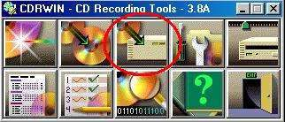
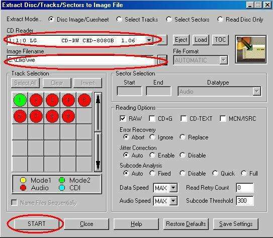

# 3 — ISO do jogo: criando uma

> Voltar ao [índice geral](/docs/biblia-we2002/README.md).

**Programas usados nesse tutorial:** CDRWIN.

O programa que 9 em cada 10 editadores de jogos usam pra criar uma imagem ISO é
o **CDRWIN**. Aconselhamos o uso das versões **3.8x** — evite outras versões.
Siga os passos abaixo pra criar uma imagem ISO.

## Passos

**a)** Coloque o CD do WE na bandeja do seu CD-ROM e inicie o CDRWIN.

**b)** Agora vá até o **terceiro botão superior** e clique nele.

**c)** Na tela que se abrirá escolha, em **CD READER**, sua unidade de CD (caso
você tenha mais de uma). Em **IMAGE FILE** clique no botão que tem 3 pontos
`[...]` e indique o nome e o lugar onde irá querer que seja salvo a imagem ISO
gerada — aconselho `WE.bin`.

**d)** Para começar a ser criada sua imagem `WE.BIN`, clique no botão **START** e
aguarde até o programa finalizar a cópia.

---

Próxima seção: [4 — Patch's: transformando um jogo em outro já editado](/docs/biblia-we2002/04-patchs.md)
