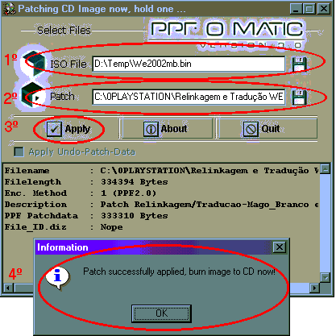

# 4 — Patch's: transformando um jogo em outro já editado

> Voltar ao [índice geral](/docs/biblia-we2002/README.md).

**Programas usados nesse tutorial:** PPF-O-MATIC (daremos preferência à v3.0).

## Introdução e explicação

Aplicar patchs é o essencial da edição de WE. Quando terminamos de fazer as
modificações num jogo, nós o submetemos a um programa que extrai dele todas as
modificações feitas e as transforma em **um arquivo**. Esse arquivo, de tamanho
reduzido, pode ser aplicado por qualquer pessoa em qualquer outro jogo, que
passará a constar das mesmas modificações que foram feitas pelo seu criador —
**isso é um PATCH**.

É assim que um jogo feito por alguém em São Paulo pode estar nas mãos de alguém
em Manaus em menos de 5 minutos pela internet: o criador em São Paulo, ao
terminar as alterações, submete-o ao programa que cria o patch e o envia pra seu
amigo em Manaus, que usa o PPF-O-MATIC e insere o patch na ISO limpa do seu
WE2002.

---

## 4a — Aplicando um patch

### Itens necessários

- A imagem ISO limpa original do WE2002 (extraia do CD como ensinado em
  [3 — ISO do jogo](/docs/biblia-we2002/03-iso-do-jogo.md)).
- O patch (baixe da internet; pergunte ao pessoal do `www.w11.com.br/forum`
  sobre eles).
- O programa **PPF-O-MATIC v3.0**.

### Executando

1. Execute o **PPF-O-MATIC v3.0**, vá em **ISO FILE** e escolha a sua imagem ISO
   do WE2002 limpa.
2. Clique no disquete ao lado de **PATCH** e escolha o patch que você baixou.
3. Aperte o botão **APPLY**.
4. **AGUARDE.** Existem processos de aplicação de patchs que levam **até 30
   minutos**. Infelizmente ele não irá informar o andamento do processo e você
   poderá achar que o seu PC travou, mas não é nada disso — é que às vezes
   demora mesmo. Quando terminar, a tela **INFORMATION** conforme a mostrada
   abaixo irá aparecer.

> **ATENÇÃO:** SEMPRE QUE FOR EDITAR UM JOGO PARTINDO DE UMA ISO ORIGINAL EM
> JAPONÊS, APLIQUE PRIMEIRO O **“PATCH DE RELINKAGEM E TRADUÇÃO”**. Ele irá
> primeiro traduzir o jogo para o português, o que facilitará a edição. Já se
> você baixar o patch da internet, use a imagem ISO **100% limpa**.

---

Próxima seção: [5 — Emuladores](/docs/biblia-we2002/05-emuladores.md)
