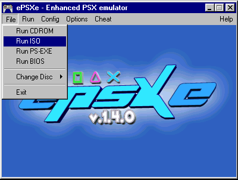

# 5 — Emuladores: aprendendo a usá-los para testar as alterações

> Voltar ao [índice geral](/docs/biblia-we2002/README.md).

**Programas usados nesse tutorial:** emulador ePSXe.

## Introdução

A cada alteração feita você irá necessitar testar o que fez ainda no
computador, antes de gravar o jogo — assim, se houver erros, você não perde CDs.
Para isso nós utilizaremos **EMULADORES**, que simulam o videogame em seu
computador e mostram como estão as alterações que você fez.

Existem diversos emuladores para PlayStation, porém daremos preferência ao
**ePSXe**, pois ele roda direto a imagem ISO do jogo no seu HD sem precisar de
truques nem da necessidade de gravar o CD.

## Executando

1. Execute o ePSXe. Na primeira vez você terá que configurá-lo; é simples, pois
   é autoexplicativo: basta, a cada pergunta, escolher um item, apertar em
   **TEST** e, se a resposta for OK, mandar prosseguir.
2. Com o programa em execução, clique em **FILE**.
3. Agora clique em **RUN ISO**. Nesse momento irá abrir uma tela **OPEN PSX
   ISO**; busque onde está sua imagem a ser executada, clique nela e clique no
   botão **ABRIR**.

4. Pronto. Agora é só testar o jogo e divertir-se, usando os controles que você
   indicou para as teclas que irão corresponder aos botões do controle do PSX.

---

Próxima seção: [6 — Jogadores: editando-os](/docs/biblia-we2002/06-jogadores.md)
