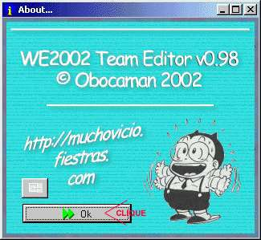
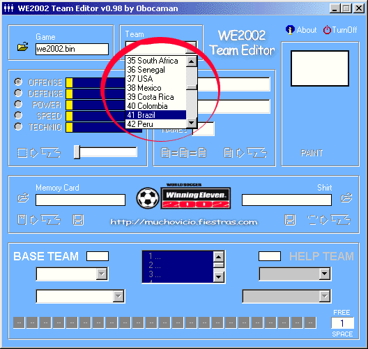
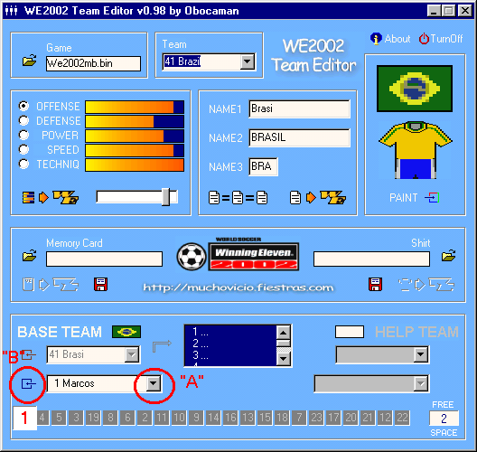
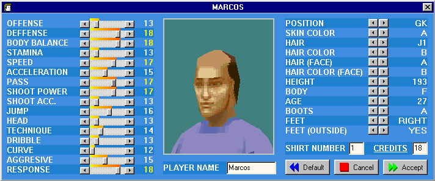

# 6 — Jogadores: editando-os

> Voltar ao [índice geral](/docs/biblia-we2002/README.md).
>
> *Tutorial by GOKUW11, aperfeiçoado.*

**Programas usados nesse tutorial:** WE TEAM EDITOR (você poderá usar o 0.98 ou
o 0.99).

## Introdução

Este tutorial irá lhe ensinar como fazer os jogadores de um time: editar suas
características visuais (cabelo, corpo, etc.) e suas habilidades (correr,
saltar, etc.). Este tutorial foi feito em função do **WE TEAM EDITOR 2002**,
pois é mais conveniente ao desejado; porém, o **WEMANIA EDITOR** também é um
excelente editor.

## Explicação

Editar os jogadores é o passo principal da edição de qualquer jogo de futebol.
Aqui você irá indicar se seu jogador é alto ou baixo, gordo ou magro, se é
negro, moreno ou branco, se tem barba ou não — essas são algumas características
físicas. Mas aqui você irá indicar também as características de habilidade do
jogador, como seu potencial de ataque e defesa, seu fôlego (estamina), se chuta
forte ou fraco, se é bom de pontaria, etc.

Para saber essas informações, aconselhamos você comprar revistas, jornais
esportivos, ver jogos na televisão, ir aos estádios, conversar com gente
entendida, ver na internet, etc.

Editar características físicas é fácil: basta pegar os dados do jogador nas
revistas ou sites da internet e copiar (idade, altura, etc.). Já as
características de habilidade irão depender **totalmente** do seu julgamento
pessoal. Evite, de início, exagerar nas qualidades: os pontos de um jogador vão
no máximo até **19**, então não coloque 19 pra todo mundo em tudo. Faça isso com
cuidado e atenção; não seja torcedor, seja crítico.

## Executando

**1º)** Execute o WE TEAM EDITOR. (Atenção: o autor tentou executá-lo no Windows
XP e não rodou; por isso usa no Windows 98.)

**2º)** Nessa 2ª tela, clique em abrir .
Selecione sua ISO onde você a salvou e mande **ABRIR**.

**3º)** No próximo passo, no menu **Team**, você escolherá o time no qual deseja
substituir ou editar. Lembre-se: esse é o nome real desse time (seleção) no jogo
WE original; os nomes que aparecerão durante o jogo estão na verdade em
**NAME1**, **NAME2** e **NAME3**.

A seguir estaremos editando a seleção do Brasil e a transformaremos no time do
Corinthians; logo, como exemplo de primeiro jogador, iremos mudar o goleiro
Marcos da seleção para Fábio Costa do Corinthians. Sendo assim, em **Team**
escolha o time a ser mudado:

**4º)** Aparecerá a seguinte tela (lembre-se de que aqui foi aplicado o patch de
relinkagem e tradução; sem ele muita coisa estaria agora em japonês). Nela vamos
escolher o jogador a ser editado: vá até a barra de rolagem no canto inferior
esquerdo e clique na seta negra apontada para baixo, marcada como item **“A”**
na imagem abaixo. Abrir-se-ão todos os jogadores daquele time; escolha o que
desejar.

**5º)** Depois de escolher o jogador que será editado, clique no item **“B”**,
neste botão .

**6º)** Após dar um clique no botão, aparecerá a seguinte tela:

**7º)** É nesta tela que nós vamos editar o jogador. Os tópicos da esquerda estão
relacionados com as **habilidades** do jogador; os tópicos do lado direito estão
relacionados com os **atributos (características) físicos**.

Na tabela abaixo você irá verificar o que cada item significa:

### Habilidades do jogador

| Nome do item | Significado |
| --- | --- |
| OFFENSE | ATAQUE |
| DEFFENSE | DEFESA |
| BODY BALANCE | EQUILÍBRIO DO CORPO |
| STAMINA | FÔLEGO |
| SPEED | VELOCIDADE |
| ACCELERATION | ACELERAÇÃO |
| PASS | PASSE |
| SHOOT POWER | FORÇA DO CHUTE |
| SHOOT ACC. | PRECISÃO DO CHUTE |
| JUMP | SALTO |
| HEAD | CABECEIO |
| TECHNIQUE | TÉCNICA |
| DRIBBLE | DRIBLE |
| CURVE | CURVA |
| AGGRESIVE | AGRESSIVIDADE |
| RESPONSE | REFLEXO |

### Características físicas

| Nome do item | Significado |
| --- | --- |
| POSITION | POSIÇÃO DO JOGADOR |
| SKIN COLOR | COR DA PELE |
| HAIR | TIPO DE CABELO |
| HAIR COLOR | COR DO CABELO |
| HAIR (FACE) | BARBA |
| HAIR COLOR (FACE) | COR DA BARBA |
| HEIGHT | ALTURA |
| BODY | MASSA CORPORAL |
| AGE | IDADE |
| BOOTS | CHUTEIRA |
| FEET | PÉ PREFERIDO |
| FEET (OUTSIDE) | MALANDRAGEM |

### Complementares

| Nome do item | Significado |
| --- | --- |
| PLAYER NAME | NOME DO JOGADOR |
| SHIRT NUMBER | NÚMERO DA CAMISA |
| CREDITS | CUSTO NA MASTER LEAGUE |

**9º)** Após realizar as alterações desejadas, clique em
.

**10º)** Pronto: suas alterações já foram gravadas na imagem de WE2002. Agora é
só testar no emulador.

## Finalizando

Aqui volto a repetir mais uma vez: essas características são indicadas por você
mesmo — as físicas pegam-se em algum lugar, mas os atributos são um julgamento
seu. Para editar um time, é só você editar um a um todos os jogadores que
constarem na seleção escolhida, seguindo os passos acima. Finalizado, você terá
seu time completo e atualizado.

---

Próxima seção: [7 — Times: criando-os](/docs/biblia-we2002/07-times.md)
