# 7 — Times: criando-os

> Voltar ao [índice geral](/docs/biblia-we2002/README.md).
>
> *Tutorial by ][Unreal][, aperfeiçoado.*

**Programas usados nesse tutorial:** WE TEAM EDITOR (você poderá usar o 0.98 ou
o 0.99).

## Introdução

Obviamente um time é formado de jogadores, e primeiro você terá que usar o
[tutorial anterior](/docs/biblia-we2002/06-jogadores.md) e montar os jogadores do
time. Daí você se pergunta: e o que é montar um time, então?

Bem, montar o time em WE é **dar nome ao time** — o que antes originalmente era
BRAZIL agora você poderá renomear como CORINTHIANS ou FLAMENGO, etc. Aqui você
também irá indicar o potencial global do seu time (se ele é retranqueiro, ou vai
muito ao ataque). Tem também os esquemas táticos, as bandeiras, o uniforme, etc.

## Executando

Para fazer as mudanças em um time vamos usar o **WE TEAM EDITOR 0.98** do
Obocaman. Com a ISO já pronta, faça o que se pede:

**1º)** Execute o WE TEAM EDITOR.

**2º)** Nessa 2ª tela, clique em abrir .
Selecione sua ISO no diretório como você fez antes.

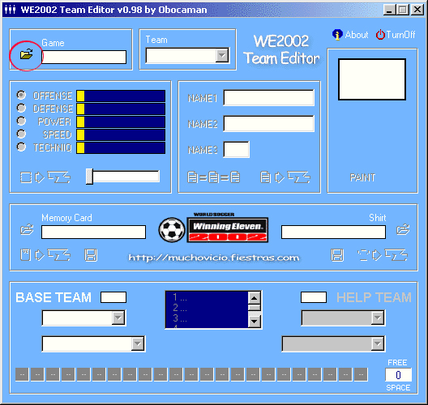

**3º)** No próximo passo, no menu **“Team”**, você escolherá o time no qual deseja
substituir ou editar.

### 4º) Editando o nome do time

Agora vamos à edição de fato: vamos dar nome ao time. No nosso caso inventamos o
time **IDEAL**. Para mudar o nome basta digitar nos campos **NAME 1**, **NAME 2**
e **NAME 3** o nome do seu time. Quando mudar, clique em
 para inserir o time na ISO. Uma janela
aparecerá informando que o nome do time foi alterado.

Lembrando que **existe limite na quantidade de caracteres, variando de time pra
time**.

| ANTES | DEPOIS |
| --- | --- |
| 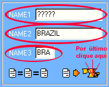 | 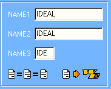 |

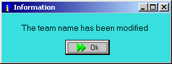

### 5º) Editando potenciais do time

Pronto, já mudamos o nome do time. Agora vamos mudar as barras dos potenciais do
time (**Ataque, Defesa, Força, Velocidade e Técnica**), que também é muito
simples. Nos campos respectivos, selecione qual barra você deseja mudar,
clicando no *option box* ao lado, e aumente ou diminua no controle de barras.
Faça isso em todos os campos. Clique no 
para inserir na ISO.

Só lembrando: isso aqui são informações **muito subjetivas** — vai depender
inteiramente do seu bom senso. Você é que dirá o quanto o time é ofensivo ou
defensivo, se tem poder em campo, se é veloz ou não, se joga com corre-corre ou
com técnica.

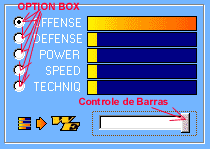

### 6º) Inserindo uniforme do time

Agora vamos inserir uma camisa no seu time. Vá ao
[tutorial de uniformes](/docs/biblia-we2002/08-uniformes.md) para aprender a criar
uma **TEX** (uniforme), ou pegue uma já pronta. Clique no
, selecione a TEX (uniforme) e clique em
 para inserir na ISO.

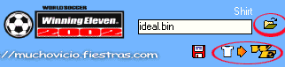

### 7º) Editando esquemas táticos do time

Pronto. Agora vamos mudar a formação, táticas e batedores. Clique no botão
**“Team Edit”** como mostrado abaixo.

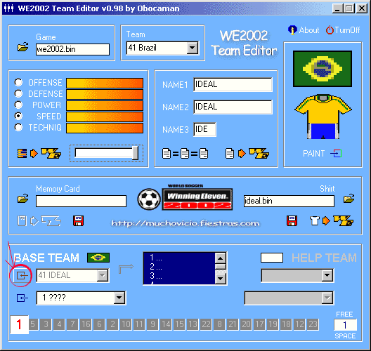

**8º)** Aparecerá no **Team Editor** a tela abaixo (caso você tenha aplicado o
patch de relinkagem e tradução). Agora vamos começar mudando a formação do time.

Caso você queira personalizar a formação padrão, basta selecionar na lista a
formação **DEFAULT**; aí basta ir clicando em cada um dos pontinhos verdes, que
correspondem aos jogadores, e arrastá-los pra posição que desejar. Caso você
queira usar uma formação pré-existente — por exemplo, **4-4-2 - B** — basta
escolher na mesma lista.

Vamos para a prática: após escolher a formação que deseja mudar (aconselho a
DEFAULT), clique sobre o jogador (pontos verdes na figura do campo) e arraste
para o lugar desejado.

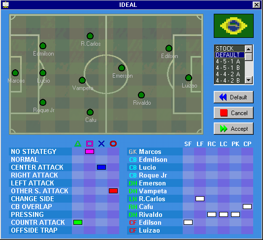

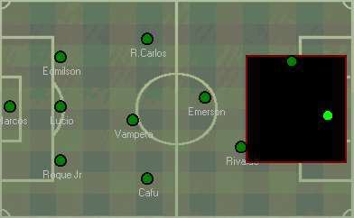

**9º)** Pronto. Ao finalizar a edição da formação, clique no botão **ACCEPT** pra
poder gravar na ISO.

**10º)** Após fazer sua formação, vamos fazer as **táticas** usadas no jogo. Para
isso, mude a posição dos quadrados de acordo com as cores referentes a cada
botão (quadrado, triângulo, X, círculo), clicando sobre as opções de tática
desejada. No nosso caso escolhemos: **NORMAL, CENTER ATTACK, RIGHT ATTACK e LEFT
ATTACK**, conforme abaixo.

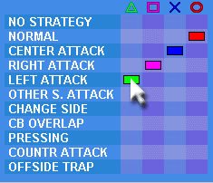

**11º)** Agora vamos para o último passo pra criar seu time: **os batedores**.

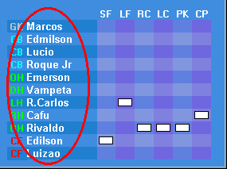

**12º)** Esses nomes marcados por um círculo vermelho são a lista dos jogadores
titulares do seu time. Para aprender a mudar o jogador (criar, modificar, etc.)
vá ao tutorial [Editando os jogadores](/docs/biblia-we2002/06-jogadores.md). Ao
seu lado existe uma tabela com:

| Coluna | Significado |
| --- | --- |
| SF | falta perto |
| LF | falta longe |
| RC | escanteio direito |
| LC | escanteio esquerdo |
| PK | pênalti |
| CP | capitão |

Basta clicar no campo respectivo do jogador para dizer quem será o cobrador de
cada item.

**13º)** Para finalizar essas mudanças, clique no botão **ACCEPT** para gravar as
modificações.

---

Próxima seção: [8 — Uniformes: editando os 2D e 3D](/docs/biblia-we2002/08-uniformes.md)
