# 8 — Uniformes: editando os 2D e 3D

> Voltar ao [índice geral](/docs/biblia-we2002/README.md).
>
> *Tutorial by ][Unreal][, aperfeiçoado. A parte 8b1 é by Squall, aperfeiçoada.*

**Programas usados nesse tutorial:** WE TEAM EDITOR (0.98 ou 0.99), CLUTED,
WEZIP, WETEX, TIMUTIL e um programa gráfico comercial (o autor usa o COREL PHOTO
PAINT; outros usam o ADOBE PHOTOSHOP — fica a gosto).

## Introdução

Um dos conceitos que deixam o usuário novato mais atordoado é: **que história é
essa de uniforme 2D e 3D?**

**Uniformes 2D** são os pequenos uniformes que aparecem na tela de opções de
jogo, antes do jogo iniciar. Lá você pode escolher, além do clima e estádio, se
cada time jogará com o primeiro ou o segundo uniforme — e é por isso que é tão
importante que esses pequenos uniformes reflitam exatamente o que são os
uniformes com que o time irá entrar em campo. Por exemplo: se substituímos o
BRAZIL pelo CORINTHIANS, o uniforme 2D original irá aparecer com camisa amarela
e calção azul; devemos mudar então isso pra camisa branca e calção preto, e
depois olhar o segundo uniforme e mudar também.

Já o **uniforme 3D** é o uniforme que o time veste em campo durante o jogo. Ele
poderá ser editado de 2 formas, que aqui ensinaremos: **mudança simples de cor**
ou **edição avançada com compressão gráfica**.

---

## 8a — Editando uniformes 2D

Como dito acima, editar uniformes 2D é editar os uniformes demonstrativos de
escolha com que o time irá entrar em campo. Para tanto usaremos o WE TEAM
EDITOR. Siga os passos:

**1º)** Execute o WE TEAM EDITOR.

**2º)** Clique em abrir. Selecione sua ISO no diretório correspondente.

**3º)** No menu **Team**, escolha o time no qual deseja substituir ou editar.

**4º)** Aparecerá a tela padrão com os dados do time que você escolheu sendo
mostrado. (*Até aqui, se você não sabe como fazer, leia os tutoriais acima —
eles mostram esses passos com imagens.*)

**5º)** Pronto, até aqui é o básico. Vamos realmente ao que interessa: vá até o
canto direito da tela; lá haverá a imagem da **bandeira** do time e, logo
abaixo, a imagem do **uniforme 2D** similar ao que existe no jogo. Clique no
botão **PAINT** para alterarmos a camisa 2D.

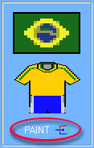

**6º)** Será aberto o editor de camisas 2D, chuteiras, bandeiras e redes.

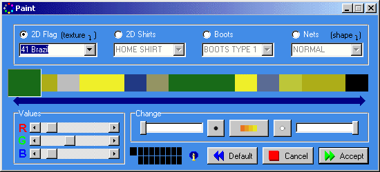

**7º)** Agora vamos editar as cores do uniforme. Para isso clique em **“2D
SHIRTS”**; temos que escolher se é o uniforme padrão (**HOME**) ou o reserva
(**AWAY**). Observe que, assim que se muda a cor na barra de cores, o uniforme
já muda no uniforme de exemplo — isso facilita muito a edição, pois são **16
cores** e cada uma corresponde a um pedaço ou detalhe do uniforme.

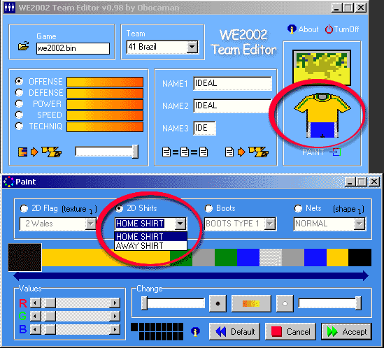

**8º)** Então, vamos mudar as cores agora desse uniforme, selecionando a cor na
barra de cores e mudando na caixa **Values**, na qual é só arrastar as barras e
ir encontrando as cores que se quer. Ficando assim:

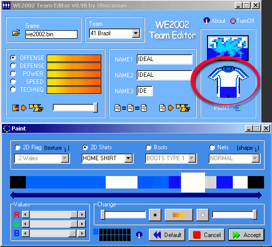

**9º)** Pronto, agora é só clicar em  e ir
testar a ISO no emulador (de preferência o ePSXe).

---

## 8b — Editando uniformes 3D (editar TEX)

Editar uniformes 3D é criar os uniformes que os times irão usar durante o jogo.
Para isso haverá 2 métodos: **mudando o uniforme original pelas cores** ou
**edição avançada com compressão gráfica**.

Na mudança simples você irá apenas pegar uniformes **originais já existentes** do
jogo e mudar apenas as cores. Por exemplo: a camisa da Seleção Brasileira é lisa
e amarela com calção azul; poderemos transformá-la no uniforme do Cruzeiro
transformando a camisa amarela em branca e mantendo o short azul — assim teremos
o uniforme reserva do time do Cruzeiro.

Já a edição com compressão gráfica é mais avançada: nela nós utilizaremos um
programa **descompressor**, que transformará uma TEX original em imagens BMP, as
quais poderão ser editadas de verdade, nos deixando incluir detalhes incríveis
como patrocinador ou pequenos detalhes. Em seguida, após a edição dos gráficos,
utilizamos um **recompressor** e criamos uma TEX (uniforme) totalmente nova e
remodelada.

---

## 8b1 — Uniformes 3D: mudando o uniforme original pelas cores

**1º)** Iniciaremos extraindo uma camisa original.

> **ATENÇÃO:** para esse método **não servem camisas editadas pelo compressor**.

Abra o editor **WE Team Editor** do Obocaman, selecione o time que você irá
modificar o uniforme e, na guia camiseta, clique no botão salvar:

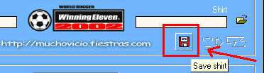

**2º)** Vamos salvá-lo com o nome de **TESTE**. Naturalmente os arquivos de
uniformes são arquivos comprimidos em formato `.BIN`; porém, nós os chamamos de
**TEX**, pois é o formato como estão escritos dentro do jogo — tipo
`TEX_01.BIN`, por exemplo. Logo, não é nem preciso colocar a extensão, pois ele
será salvo no formato `.BIN`.

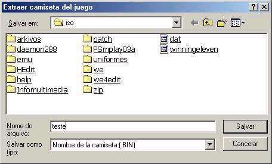

**3º)** Abra o programa **CLUTEd** e em seguida clique em **“Extract clut from
TEX file”**.

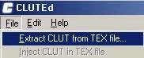

**4º)** Escolha o uniforme que você salvou como TESTE.

**5º)** Na janela **“Select CLUT to modify”**, selecione **“Players shirt #1
palette”** (isso para editar a primeira camisa do time; para a segunda, siga
adiante repetindo o tutorial).

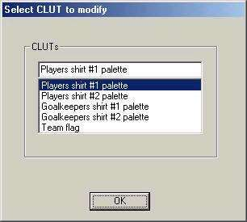

**6º)** Depois disso irá aparecer essa tela:

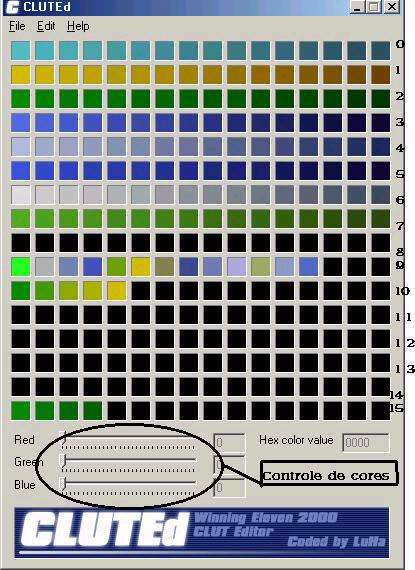

Os números à direita (de 0 a 15, segue-se a sequência) representam uma parte do
uniforme cada um:

| Número | Representa na camisa... |
| --- | --- |
| 0 | Faixa de capitão |
| 1 | A cor principal da camisa (cor primária) |
| 2 | A cor “sub-principal” da camisa (cor secundária) |
| 3 | Detalhes “1” da camisa |
| 4 | Detalhes “2” da camisa |
| 5 | A cor do shorts |
| 6 | A cor das meias |
| 7 | Detalhes no uniforme (varia de uniforme p/ uniforme) |
| 8 | Detalhes no uniforme (varia de uniforme p/ uniforme) |
| 9 | Detalhes no uniforme (varia de uniforme p/ uniforme) |
| 10 | Detalhes no uniforme (varia de uniforme p/ uniforme) |
| 11 | Detalhes no uniforme (varia de uniforme p/ uniforme) |
| 12 | Detalhes no uniforme (varia de uniforme p/ uniforme) |
| 13 | Detalhes no uniforme (varia de uniforme p/ uniforme) |
| 14 | Detalhes no uniforme (varia de uniforme p/ uniforme) |
| 15 | Número da camisa |

Já as caixas marcadas **“Red”**, **“Green”** e **“Blue”** são as caixas de
cores, onde você pode mexer nas cores para modificá-las. Movendo os controles
p/ direita as cores escurecem, e para a esquerda as cores clareiam. Ex.: se você
selecionar o vermelho para modificar e mover para a direita, ele vai ficar mais
escuro, parecido com vinho; mas se você mover para a esquerda ficará mais claro,
parecido com rosa.

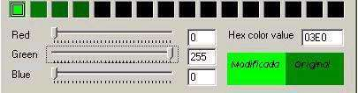

Na imagem acima vemos uma modificação nas cores: onde está escrito
**“Modificada”** é a cor alterada, e onde marca **“Original”** é a cor original
do uniforme.

Depois desses conceitos básicos, basta você modificar as cores de acordo com o
uniforme que você quer. Deve-se prestar atenção no tipo de uniforme selecionado
para não haver complicações. Por exemplo: se você pegar um uniforme do Brasil,
não irá conseguir deixá-lo listrado, pois o uniforme do Brasil não é listrado. A
mesma coisa irá acontecer se você pegar o uniforme do Paraguai e tentar
deixá-lo todo de uma cor, pois ele é listrado.

> **IMPORTANTE:** assim como as bandeiras, utilizando este método **não é
> possível criar seus uniformes com textura diferente** — ou seja, não dá pra
> meter escudo, patrocinador, etc. Você poderá apenas modificar as cores.
> Portanto escolha o uniforme o mais parecido possível com o que você quer
> criar. Esse método é mais simples, fácil e rápido; porém, os resultados são
> menos perfeitos.

---

## 8b2 — Uniformes 3D: edição avançada com compressor

### Preparação

Abra um diretório (pasta) chamado **COMPRESSOR**; nele coloque os programas
**WEZIP**, **WETEX** e **TIMUTIL**. Dentro dele crie as subpastas
**ORIGINAIS**, **DESCOMPRIMIDOS**, **RECOMPRIMIDOS** e **TRABALHO**.

O autor criou também uma pasta chamada **DEPOSITO**, pra guardar as coisas
antigas já feitas ao iniciar novos trabalhos — essa pasta é opcional, mas as
outras são obrigatórias.

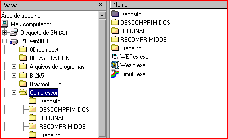

### Executando

**a)** Extraia com o **WE Team Editor** do Obocaman a camisa do time que você
deseja aperfeiçoar, de algum jogo onde ela exista. Por exemplo: trabalharemos na
montagem da camisa do Santos; o autor extraiu a camisa do Santos que tinha no
BR2002, pois ela não foi feita no compressor — foi editada apenas nas cores, em
cima de uma TEX original, logo mantém as características originais. Em seguida,
coloque-a na pasta **ORIGINAIS**.

**b)** Execute o **WEZIP** e clique no botão **DESCOMPRIMIR** (1). Irá abrir uma
nova tela; informe em **“Imagen comprimida del WE”** (2) o uniforme que você
colocou na pasta ORIGINAIS — no nosso caso, `Santos.bin`. Em **“Formato de la
Imagen”** (3) coloque **“TEX Camisetas”**. Pronto, agora é só ir no disquetinho
que tem ao lado do nome (4) **“Guardar a Imagen TIM”** e informar a pasta
**DESCOMPRIMIDOS**. Clique no botão vermelho **“Descomprimir”** (5) e aguarde;
alguns segundos depois irá aparecer uma tela avisando da descompressão (6).

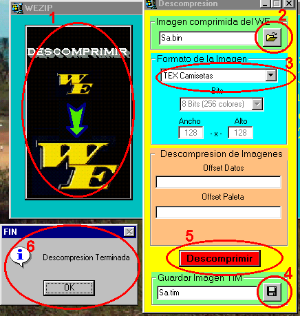

**c)** Ele irá gerar **10 arquivos**, sendo:

| Arquivo | O que é |
| --- | --- |
| `Sa_eqTITjug.TIM` | Equipe Titular Jogador — a camisa que seu time usará nos jogos de mando |
| `Sa_eqTITarq.TIM` | Equipe Titular Arqueiro (goleiro) — a camisa do seu goleiro nos jogos de mando |
| `Sa_eqSUPjug.TIM` | Equipe Suplente (reserva) Jogador — a camisa usada nos jogos como time de fora |
| `Sa_eqSUParq.TIM` | Equipe Suplente Arqueiro — a camisa do seu goleiro nos jogos como time de fora |
| `Sa_eqTITmlJUG.TIM` | Equipe Titular Mangas Longas Jogador — jogos de mando estando frio |
| `Sa_eqTITmlARQ.TIM` | Equipe Titular Mangas Longas Arqueiro — goleiro em mando estando frio |
| `Sa_eqSUPmlJUG.TIM` | Equipe Suplente Mangas Longas Jogador — jogos fora de casa estando frio |
| `Sa_eqSUPmlARQ.TIM` | Equipe Suplente Mangas Longas Arqueiro — goleiro fora de casa estando frio |
| `Sa_bandera.TIM` | Bandeira — aparecerá na torcida durante o jogo, nas laterais |
| `Sa_arbitro.TIM` | Árbitro — uniforme do árbitro que apitará seus jogos |

**d)** Agora iremos passar esses arquivos do formato `.TIM` para o formato
`.BMP`, que é possível de edição. Iniciaremos com a camisa principal; com base no
que será ensinado nela, repita nas outras — é tudo a mesma coisa.

O programa que passa de TIM para BMP é o **TIMUTIL**. Porém, ele só reconhece
nomes de arquivos com **até 8 (oito) letras**, por isso você vai ter que reduzir
os nomes dos arquivos com que for trabalhar. Como iniciaremos com a camisa
principal, pegue o arquivo `Sa_eqTITjug.TIM` e retire o `Sa_` do início (ou, a
depender do nome que você colocou, retire as primeiras letras e deixe só as 8
últimas). Nesse caso deixaremos o nome do arquivo como `eqTITjug.TIM`.

Em seguida execute o TIMUTIL, vá em **FILE → OPEN** e procure o `eqTITjug.TIM`,
que deverá estar na pasta DESCOMPRIMIDOS.

Irá abrir uma janela branca com textos; entre eles terá um box onde se lê **“Read
Type”**, informando que foi lido um TIM (1) — não mexa aqui. Na caixa abaixo
dela, **“Write Type”**, você deverá marcar o item **BMP** (2). Se desejar, clique
em **Preview** pra ver como ficará; senão clique em **CONVERT** (3). Ele
perguntará onde salvar: escolha a pasta **TRABALHO** e clique em OK. Ele irá
gerar então o arquivo `eqTITjug.BMP` na pasta TRABALHO. Pronto, pode fechar o
TIMUTIL.

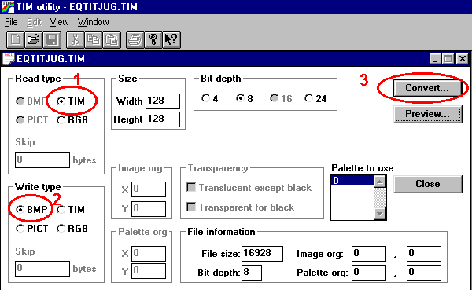

**e)** Abra o seu programa gráfico favorito — pode ser o COREL PHOTO PAINT, o
ADOBE PHOTOSHOP, ou até o PAINT BRUSH (MSPAINT) do Windows. Vá até a pasta
TRABALHO e mande abrir o arquivo `eqTITjug.BMP` que você acabou de gerar. (O
autor usa aqui o PAINT do Windows mesmo, pois todo mundo tem e facilita; mas os
recursos dele são escassos — aconselha-se aprender depois a usar um programa
mais potente.)

Como a camisa do Santos é toda branca, será usada a camisa do Corinthians para
demonstrar o que é cada parte:

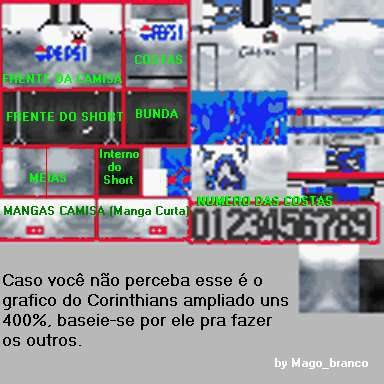

**f)** Aberto o MSPAINT com a camisa do Santos, vá em **EXIBIR → ZOOM →
PERSONALIZAR** e escolha **800%**, ou o tamanho que você achar mais cômodo. Em
seguida vá de novo em **EXIBIR → ZOOM → MOSTRAR GRADE**.

Você irá notar que a tela ficará toda quadriculada: cada quadradinho desse é um
**bit**, e ele aceita somente uma única cor.

**g)** Bem, a coisa de agora em diante depende do seu instinto artístico.

Ou seja, você pode ter que escrever o nome de um patrocinador e simplesmente ir
preenchendo os quadradinhos, como no caso do Corinthians acima:

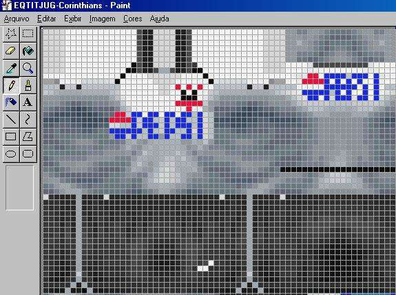

Como você vê, tudo que foi feito foi ir preenchendo os quadradinhos na tentativa
de encontrar a melhor aparência pro nome PEPSI — não foi utilizado nenhum outro
artifício. Porém, aqui foi utilizado somente um tom do azul; isso dá um efeito
que, no caso do nome PEPSI do Corinthians, é aceitável, mas em outros casos você
terá que utilizar vários tons mais claros e escuros da mesma cor pra poder dar
um efeito melhor. Isso é feito assim pois o espaço é mínimo; você tem que ser
criativo pra criar um bom resultado.

Utilizando um bom programa gráfico como o Corel Photo Paint, você pode copiar e
colar uma logomarca, e ele dará as nuances de cores pra você. Em resumo: aqui a
coisa é artística, fica a seu gosto.

**h)** Vamos voltar à edição da camisa do Santos. O primeiro passo, após abri-la
no MSPAINT, é ampliá-la e **apagar os detalhes originais**, pra poder refazê-los
mais perfeitos em seguida:

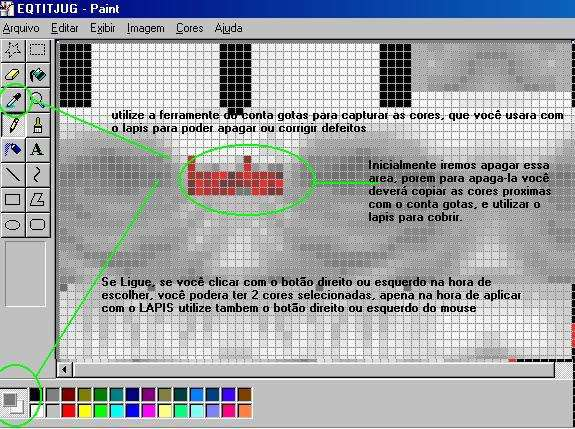

Os próximos passos são a construção dos detalhes e, se você desejar, a
visualização dele no **Visor3Deluxe**:

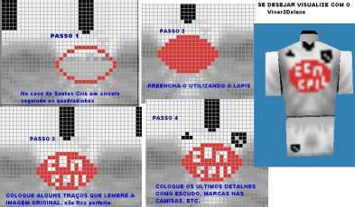

**i)** Como dito antes, uma segunda forma de fazer é abrindo a imagem em um
programa tipo o ADOBE PHOTOSHOP ou COREL PHOTO PAINT: no caso desses programas,
os subtons das cores são feitos por eles mesmos, mas nem sempre com um bom
efeito. O bom é tentar os dois métodos e ver como fica melhor.

Para isso é só você abrir o programa e mandar abrir a imagem base; em seguida
pegue o detalhe — no nosso caso, extraia de outra imagem a logomarca da Bombril
(você pode tirar de alguma imagem que baixou da net), recorte somente ele,
amplie o uniforme um pouco no zoom e cole.

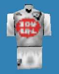

Aí é que está: o autor gostou de uns detalhes da camisa feita no Photo Paint e
uns detalhes feitos no MSPAINT. Aí é fácil: é só abrir em qualquer lugar e
copiar o que você achar bom, de um pro outro, e corrigir na mão o que você não
gostou nem em um, nem no outro.

Nesse caso, as 2 imagens foram levadas pro MSPAINT e foi-se revendo o que dava
pra melhorar, pois o lance de escolha de tons mais escuros e claros da mesma cor
ajuda a criar efeitos. Veja como ficou o resultado final — mas lembre-se, isso
depende do seu gosto: aqui o logo da Bombril foi em parte reduzido de um
original, mas mesmo assim foi melhorado; já o escudo foi todo feito à mão.

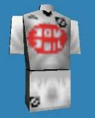

**Dessa forma a camisa principal está pronta.**

### i.1) Fazendo os detalhes no Corel Draw

Uma outra forma muito legal de se fazer os detalhes é com o **Corel Draw** (ou
qualquer editor de gráficos vetoriais). Faça assim:

- Abra uma página em branco.
- Vá em **IMPORT** e mande importar o uniforme que você vai fazer; dê
  preferência a ele já ter sido limpo antes, ou seja, tirados os gráficos
  originais e deixado apenas o espaço pra inserir o novo, no lugar dos
  patrocínios.
- Em seguida dê uma olhada em algum lugar e veja como é a camisa original — ou
  seja, como é o patrocínio — e crie-o no Corel; não precisa ser muito perfeito,
  visto que ele vai ser distorcido depois.
- Feito isso, minimize seu desenho, e você verá que o gráfico feito por você no
  Corel continua com qualidade máxima (mas isso só é dentro do Corel). Ajuste o
  patrocinador no lugar.
- Agora marque o que você fez, e não deixe mais nada no Corel além do uniforme e
  do patrocínio que você fez.
- Vá agora em **Exportar** e mande ele exportar para **BMP**.

Pronto! Agora é só abrir no MSPAINT e corrigir as falhas.

### j) A camisa de mangas longas

Para isso você vai ter que encurtar o nome do arquivo, como foi feito com o da
camisa principal: o nome original do arquivo é `Sa_eqTITmlJUG.TIM`, mas como você
só pode deixá-lo com 8 letras, renomeie-o para `eqTTmlJG.TIM`.

Agora é só seguir os mesmos passos que você fez com a camisa principal: abra o
TIMUTIL e mande ele converter de TIM para BMP o arquivo que está na pasta
DESCOMPRIMIDOS, transformando-o em BMP na pasta TRABALHO.

Agora veja de novo, na camisa do Corinthians, o que é cada parte:

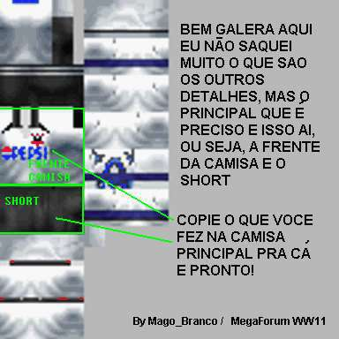

O próximo passo é você mandar o Windows abrir **2 MSPAINT** (ao contrário de
outros programas, o MSPAINT só abre uma tela por vez; você tem que abri-lo 2 ou
mais vezes se quiser mais de uma imagem na tela). Abertos os dois, em um você
deverá abrir o seu arquivo da camisa principal, feito anteriormente, e no outro
o seu arquivo de mangas longas.

Em seguida copie os detalhes do principal e cole no seu arquivo de mangas
longas; é muito fácil, é só se guiar pela aba que corresponde ao pescoço:

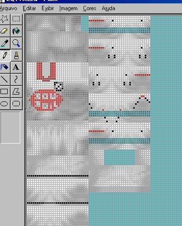

Pronto, está pronto seu arquivo de camisa mangas longas.

> **PRÓXIMO PASSO:** repetir o que você aprendeu fazendo as camisas do **goleiro
> principal** (manga curta e manga longa) e do **goleiro suplente** (reserva) —
> ou seja, os arquivos `Sa_eqSUPjug.TIM` e `Sa_eqSUPmlJUG.TIM`.

### l) As bandeiras que ficam nos campos

Siga os mesmos passos ensinados acima com o arquivo da bandeira, até
transformá-lo em BMP. Se você pegar a imagem da bandeira e tentar editar com
qualquer cor, vai perceber que nem todas as cores são aceitas — isso devido à
**paleta de cores**. Por isso, escolha a bandeira de outro time que tenha
originalmente as cores que você deseja inserir:

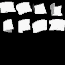

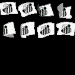

Pronto, agora é fácil: basta você copiar e inserir as bandeiras do time que
desejar. Mas se ligue nos detalhes: a terceira e a quarta bandeiras de cima,
assim como a primeira e a segunda de baixo, estão **pela metade**, pois estão
dobradas. Dessa forma o escudo só deverá aparecer um pedaço; pra isso acontecer,
apague o pedaço do escudo que deve ficar invisível:

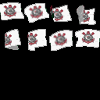

**Pronto — feito isso, você acabou de editar todos os arquivos BMP.**

---

## Criação da TEX (o uniforme em si)

Bem, aqui você irá se perguntar: por que usar o **WETEX** se posso facilmente
inserir as imagens usando um compressor como o do Walxer? A resposta é simples:
**o compressor do Walxer faz o jogo travar** quando você insere os gráficos do
uniforme com ele. Logo, a única opção disponível é o WETEX.

**m1)** O próximo passo é passar todos eles pro formato `.TIM`, utilizando o
programa **TIMUTIL**.

> **ATENÇÃO, SE LIGUE:** na hora de compactar o arquivo da **bandeira**, você
> deverá marcar a caixa do TIMUTIL onde tem escrito **“TRANSPARENT FOR BLACK”**.
> Senão haverá falhas.

**m2)** Agora abra o **WEZIP**, vá na função **COMPRIMIR** e mande comprimir todos
os `.TIM` que estão na pasta TRABALHO, mandando-os para a pasta
**RECOMPRIMIDOS** à proporção que vão sendo compactados.

**m3)** Agora abra o **WETEX**. Veja o que vai em cada lugar:

### TITULAR

| Campo | Arquivo |
| --- | --- |
| Imagen Comprimida | `RECOMPRIMIDOS/EQTITJUG.bin` |
| Paleta Jugador | `TRABALHO/EQTITJUG.TIM` |
| Paleta Arquero | `TRABALHO/EQTITARQ.TIM` (isso se você editou ela; senão, DESCOMPRIMIDOS) |
| Mangas Largas | `RECOMPRIMIDOS/EQTTMLJG.bin` |

### SUPLENTE

| Campo | Arquivo |
| --- | --- |
| Imagen Comprimida | `RECOMPRIMIDOS/EQSUPJUG.bin` |
| Paleta Jugador | `TRABALHO/EQSUPJUG.TIM` |
| Paleta Arquero | `TRABALHO/EQSUPARQ.TIM` (isso se você editou ela; senão, DESCOMPRIMIDOS) |
| Mangas Largas | `RECOMPRIMIDOS/EQSPMLJG.bin` |

### EQUIPO

| Campo | Arquivo |
| --- | --- |
| Imagen Bandera | `RECOMPRIMIDOS/BANDEIRA.bin` |
| Paleta Bandera | `TRABALHO/BANDEIRA.TIM` |
| Arbitro | `RECOMPRIMIDOS/ARBITRO.BIN` |

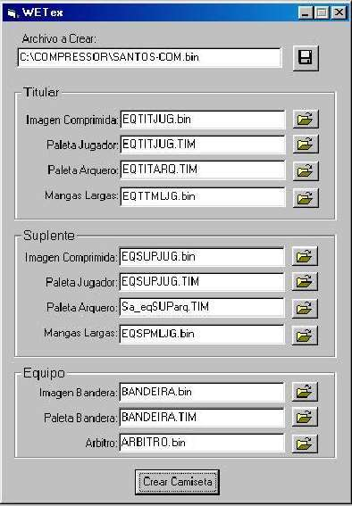

Agora vá lá na parte de cima, onde tem **Archivo Crear:**, e clique; mande salvar
onde você quiser, com o nome que desejar. Clique no botão **Crear camisa** — e
pronto!

## Inserindo a TEX na ISO

Agora é só abrir o **CDMAGE**, ir na pasta **BIN**, escolher algum arquivo com o
formato `TEX_00.BIN`, `TEX_02.BIN`, `TEX_10.BIN` ou qualquer número a sua
escolha. Clique com o botão direito do mouse em cima dele e clique em seguida em
**IMPORT FILE...**. Ele fará uma pergunta em inglês: responda **OK**.

Pronto, está inserido. Agora é só rodar a ISO do jogo num emulador para ver o
resultado, ou gravar o CD e jogar.

---

Próxima seção: [9 — Telas do início do jogo](/docs/biblia-we2002/09-telas-de-inicio.md)
