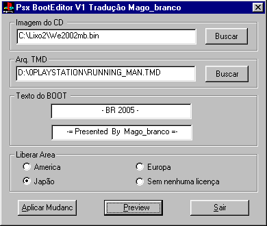
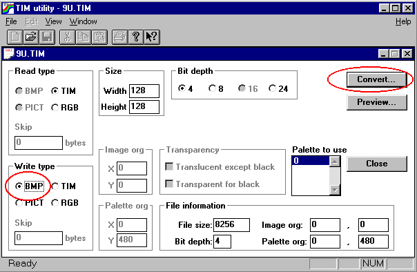
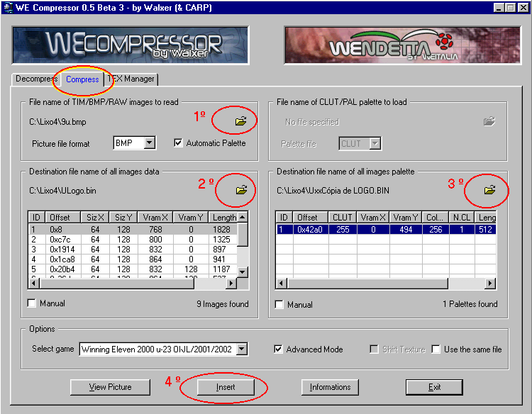

# 9 — Telas do início do jogo (Boot, Logo, Title e bola do menu)

> Voltar ao [índice geral](/docs/biblia-we2002/README.md).

**Programas usados nesse tutorial:** CDMAGE, emulador ePSXe 1.4.0, HEDIT,
BOOTEDIT, WE IMAGE MANAGER 0.5, TIMUTIL, WE COMPRESSOR 0.5 by Walxer, editor
gráfico COREL PHOTO PAINT.

## Introdução

Quando você inicia o jogo, ele apresenta originalmente uma primeira tela com o
gráfico do **“P”** do PlayStation estilizado, mais uma frase abaixo tipo *SONY
ENTERTAINMENT OF...*. Em seguida virão **3 telas** que apresentam logos — um da
Konami, o segundo uma autorização da Adidas e por último um logo da JFA. Entrará
então o vídeo de abertura, e você terá uma última tela com o nome do jogo, onde o
narrador japonês diz o nome do jogo e o fundo se move como se fosse uma chuva de
traços vindo em sua direção.

Todas essas telas podem ser mudadas para personalizar seu jogo editado, e é isso
que iremos lhe ensinar agora.

---

## 9a — Visualizando o BOOT no emulador

Para poder fazer alterações no BOOT é ideal que você veja o que está fazendo.
Para isso siga os seguintes passos:

**a)** Execute o emulador **ePSXe 1.4.0** (o autor tentou com versões mais novas,
mas não funcionou).

**b)** Vá até a opção **CONFIG → CDROM** e **marque as duas caixas de opção**;
salve e saia.

**c)** Agora execute o **HEDIT** e mande abrir a ISO do jogo a mudar a abertura.

**d)** Vá até o offset **`0xD37A`** e substitua o número **“8”** por **“9”**;
salve, mas não precisa fechar o HEDIT.

**e)** Agora execute o ePSXe e mande rodar a ISO modificada e aguarde um pouco. O
jogo provavelmente não irá iniciar; irá mostrar apenas a tela inicial de boot de
abertura.

**f)** Pronto, agora você poderá ver o que está editando na tela do boot.

> Após editar, lembre-se de **RETORNAR O NÚMERO “9” PARA O ORIGINAL “8”** no
> offset `0xD37A` e salvar — senão o jogo será incapacitado de iniciar.

---

## 9b — Editando o BOOT via programa (texto e gráfico)

Podemos editar via programa ou via editor hexa; primeiro ensinemos via programa.

**a)** Execute o programa **BOOT EDIT.EXE**.

**b)** A tela a seguir irá aparecer. Preencha os campos:

- **IMAGEM DO CD** — clicando em **BUSCAR** e procurando a ISO do jogo.
- **ARQ. TMD** — clicando em **BUSCAR** e buscando um arquivo `.TMD` (para
  encontrá-lo, busque na internet em sites de busca como o Google; esses
  arquivos são as imagens).
- **TEXTO DO BOOT** — preencha os dois campos, sendo que cada um corresponde a
  uma linha no jogo.
- Por último clique em **LIBERAR ÁREA**, escolhendo uma delas — aconselho ou
  Japão ou América.

**c)** Por último clique no botão **APLICAR MUDANÇAS**.

> **ATENÇÃO:** ao terminar de aplicar, execute os procedimentos de
> [visualizar o BOOT](#9a--visualizando-o-boot-no-emulador) e veja como ficou o
> resultado. Normalmente o texto fica truncado; vá mexendo no posicionamento das
> letras até encontrar algo que te agrade.

---

## 9c — Editando o BOOT via editor HEXA (texto)

**a)** Execute o editor hexadecimal e vá até o offset **`0x24D8`** ou
**`0x2E08`**.

**b)** Edite o texto a seu gosto e mande salvar.

**c)** Execute os procedimentos de visualizar o BOOT e veja como ficou o
resultado. Normalmente o texto fica truncado; vá mexendo no posicionamento das
letras — mexendo, salvando, emulando e mexendo de novo — até chegar onde você
deseje.

---

## 9d — Editando o BOOT via editor HEXA (gráfico)

**a)** Execute o editor hexadecimal e abra um arquivo `.TMD` a seu gosto.

**b)** Marque e copie todo o conteúdo desse arquivo `.TMD`.

**c)** Execute o editor hexadecimal e vá até o offset **`0x2E08`**.

**d)** Cole aqui o conteúdo copiado anteriormente.

---

Agora editaremos a segunda tela gráfica, que é o **LOGO**. Esses próximos 3
gráficos se encontram no arquivo **`LOGO.BIN`**.

## 9e — Editando o LOGO.bin (1ª tela)

**a)** Execute o programa **CDMAGE** e extraia o arquivo `LOGO.BIN` (faça uma
cópia por segurança).

**b)** Execute o programa **WE IMAGE MANAGER 0.5** e mande abrir, tanto na parte
de cima (gráfico) como na de baixo (paleta), o arquivo `LOGO.BIN` a ser editado.

**c)** Os gráficos **7, 8 e 9** do Image Manager correspondem ao primeiro
gráfico.

**d)** As paletas devem ser colocadas manualmente: para isso clique em
**MANUAL**; em cores coloque **4 BITS**.

**e)** Agora você terá que extrair os arquivos `.TIM` de cada gráfico. Para isso
precisará **casar o gráfico de cima com a paleta correta na parte de baixo**; só
depois poderá mandar extrair a imagem.

**f)** O gráfico **7** tem como paleta de cores o offset **17280**.

**g)** Já os gráficos **8 e 9** têm como paleta de cores o offset **17344**.

**h)** Extraia os arquivos TIM clicando no botão **DESCOMPRIMIR** e salve-os em
algum lugar com nomes identificáveis posteriormente.

**i)** Agora execute o programa **TIMUTIL.EXE** e mande abrir o primeiro arquivo
`.TIM`; aparecerá uma tela similar a essa:

**j)** Marque a opção **BMP** na caixa **Write Type** e em seguida clique no botão
**CONVERT** (se desejar antes ver se abriu o gráfico correto, pode clicar em
**PREVIEW**). Pronto: os gráficos serão convertidos para simples gráficos BMP
editáveis.

**k)** Até esse ponto a coisa dependeu de técnica; agora irá depender de suas
capacidades artísticas. Execute um programa de edição gráfica comercial como o
Adobe Photoshop ou o Corel Photo Paint, edite os BMPs a seu gosto e salve.

**l)** Uma boa dica aqui é:

- Edite a **imagem 7** com o símbolo/logomarca do campeonato, ou algum desenho
  que faça jus ao jogo. Aqui você deverá editar a imagem **apenas na metade
  esquerda exata**; a imagem não poderá utilizar toda a altura, mas só a metade
  do gráfico na largura, pois quando inicia o jogo ele irá duplicar a imagem — e
  se houver algo do lado direito, o que houver na esquerda ficará por cima.
- Já a **imagem 8**, coloque-a totalmente em negro, para que não apareça nada.
  Aqui o correto não seria nem o negro: seria o tom neutro, que normalmente é
  reconhecido pelo jogo como negro absoluto ou transparente (0,0,0 de cores).
- Já na **imagem 9**, coloque os textos com o nome do jogo.

**m)** Execute o **WE COMPRESSOR 0.5 by Walxer** e clique na aba **COMPRESS**.

**n)** Em **“FILE NAME OF TIM/BMP IMAGE READ”** (1º), clique na pastinha amarela e
escolha a imagem BMP que você editou.

**o)** Em **“DESTINATION FILE NAME OF ALL IMAGE DATA”** (2º), abra o seu
`LOGO.BIN` e selecione o número da imagem que você editou.

**p)** Agora vá em **“DESTINATION FILE NAME OF ALL IMAGES PALETTE”** (3º), do
outro lado do editor, e abra também o seu `LOGO.BIN`; clique em **Manual** e
insira o número da paleta a inserir. (Uma dica aqui: se você não mudou a paleta,
tire uma cópia descartável do seu `logo.bin`, meta a paleta nele e depois o
apague.)

**q)** Pronto, agora é só clicar em **Insert** (4º). Algumas vezes ele informa que
o tamanho do arquivo é maior e pergunta se você deseja ou não inserir; aqui o
tamanho é incorreto — o correto mesmo aparece no **WE IMAGE MANAGER**. Vá lá e
veja o tamanho correto: se o seu for igual ou menor, mande inserir; se não, você
terá que refazer com menos detalhes, senão irá haver problemas.

**r)** Agora reinsira o `Logo.bin` na ISO com o CDMAGE e teste no emulador ePSXe.

---

## 9f — Editando o LOGO.bin (2ª tela)

A segunda tela do `Logo.bin` aparece rapidamente, mas vale a pena ser editada. A
imagem se encontra nos gráficos **1 e 2** do `logo.bin`, tendo para ambos a
paleta que deverá também ser colocada manualmente, conforme ensinado acima, no
offset **17120**.

Para editar a segunda imagem do `logo.bin` você deverá seguir os mesmos passos
ensinados acima; porém, ao extrair as imagens BMP, **junte as duas** e faça a
edição; após editá-las em um editor gráfico, **divida-as** e siga os mesmos
procedimentos acima ensinados.

---

## 9g — Editando o LOGO.bin (3ª tela)

Por último temos a terceira tela: no original teremos um imenso símbolo da
Konami, mas aqui vamos mudar isso.

Os gráficos correspondentes dessa terceira imagem são os **3, 4, 5 e 6**; para
todos eles a paleta é a **17088**.

O autor costuma editar as imagens **3 e 4** como sendo as metades de uma só, pois
essas imagens correspondem à parte de cima do gráfico. Já na imagem **5** costuma
colocar o texto com alguma indicação sobre a imagem que colocou. E por último a
imagem **6**, que é a borda que circula a imagem, na qual você pode fazer
modificações artísticas à vontade.

Aqui também use os mesmos passos do
[9e — Editando o LOGO.bin (1ª tela)](#9e--editando-o-logobin-1ª-tela) e mude
apenas as indicações dos números do gráfico e da paleta; o resto é igual.

---

## 9h — Editando o TITLE.bin (tela com o título do jogo)

O `Title.bin`, ou tela de título do jogo, é aquela tela onde aparece o título do
jogo e logo abaixo o tradicional **PRESS ANY BUTTON** — ou seja, é aquela tela
que vem logo após o vídeo de abertura.

O arquivo do `title.bin` é composto de **três imagens**: as duas superiores
relativas à imagem com os símbolos do jogo, e a última imagem relativa às notas
de rodapé, ao nome PRESS ANY BUTTON, e que também pega o trecho final da imagem
das duas primeiras. Só que, para facilitar a edição, usaremos para o símbolo do
nosso jogo apenas as duas primeiras imagens; apagaremos os resquícios na terceira
imagem e utilizaremos essa terceira apenas para, como dito, as notas de rodapé e
a mensagem de apertar um botão.

Para editar o title, siga os passos:

1. Execute o **CDMAGE** e abra a imagem do jogo.
2. Vá até a pasta **BIN** e localize o arquivo `TITLE.BIN`; clique com o botão
   direito do mouse sobre ele e aperte a opção **EXTRACT FILE**.
3. Execute o **WE IMAGE MANAGER** e abra o `title.bin` extraído, tanto na parte
   de cima (gráfico) como na de baixo (paleta).
4. As imagens **1 e 2** têm como paleta o **ID 1**.
5. A imagem **3** é mista: tem as letras de rodapé com paleta também no **ID 1**,
   já o nome **PRESS ANY BUTTON** tem a paleta no **ID 2**.
6. Extraia os TIMs e transforme em BMPs conforme ensinado no tutorial
   [Imagens no jogo](/docs/biblia-we2002/11-imagens.md).
7. Pronto, agora é só reinserir a imagem com o CDMAGE e testar no emulador.

---

## 9i — Editando a bola da tela do menu

É bem interessante editar a **bola do menu**, como chamamos esse gráfico, pois ele
dá a capacidade de você personalizar seu patch não só nas telas de abertura, mas
durante as próprias telas de escolha — mantendo assim um espírito de
originalidade sobre seu patch, que, ao invés de ter na tela de escolha o nome
WE2002, vai ter o nome e o símbolo do seu patch.

Para editar a bola do menu siga os seguintes passos:

1. Execute o **CDMAGE** e abra a imagem do jogo.
2. Vá até a pasta **BIN** e localize os arquivos `DATSEL.BIN` e `DAT2D.BIN`;
   clique com o botão direito do mouse sobre cada um e aperte **EXTRACT FILE**
   para extraí-los. (Volto a lembrar: tire sempre uma cópia de segurança pra
   poder voltar atrás em caso de alguma falha.)
3. Execute o **WE IMAGE MANAGER** e abra, na parte superior (gráfico), o arquivo
   `DATSEL.BIN` extraído; já na parte de baixo (paleta), abra o `DAT2D.BIN`.
4. As imagens **14 e 15** (offsets **104408** e **109156**) têm ambas a paleta de
   cores no **ID 152 (73124)** — porém, só no tocante à imagem da bola ou símbolo
   que você vier a modificar, visto que no caso do ID 15 (109156) ela é um
   gráfico com **paleta múltipla**: existem dois textos abaixo do símbolo, o
   primeiro, que no original é o nome **WINNING ELEVEN** (que, por sinal, na hora
   que o jogo for executado, irá aparecer não abaixo, mas **sobre** o símbolo),
   tem a paleta no **ID 155 (73220)**; já o último texto, que é o nome **2002**,
   tem **ID 116 (71972)**.
   É útil informar que nesse gráfico ID 15, de cima para baixo, os tamanhos das
   partes são: o superior vai até os **53 pixels**, o primeiro texto vai até os
   **102 pixels**, e o último vai até o final.
5. Um segundo detalhe a ser informado é que, como as imagens 14 e 15 deverão ser
   juntas uma sobre a outra pra ser editadas, na verdade, na hora da inserção,
   elas **não deverão estar lineares** — a imagem 15 fica **8 pixels à
   esquerda**.
6. As imagens **16 e 17** são, no original, a luz que ilumina a bola, mas podem
   ser alteradas para se colocar qualquer outro gráfico; a paleta aqui
   encontra-se no **ID 115 (71940)**.
7. Extraia os TIMs e transforme em BMPs conforme ensinado no tutorial
   [Imagens no jogo](/docs/biblia-we2002/11-imagens.md).
8. Lembre-se de que aqui as imagens são **montadas** — ou seja, metade em um
   trecho, metade no outro. Logo, faça o cruzamento correto após a montagem e
   teste no emulador após inserir o arquivo já com as modificações, usando o
   CDMAGE.

---

Próxima seção: [10 — Textos no jogo](/docs/biblia-we2002/10-textos.md)
