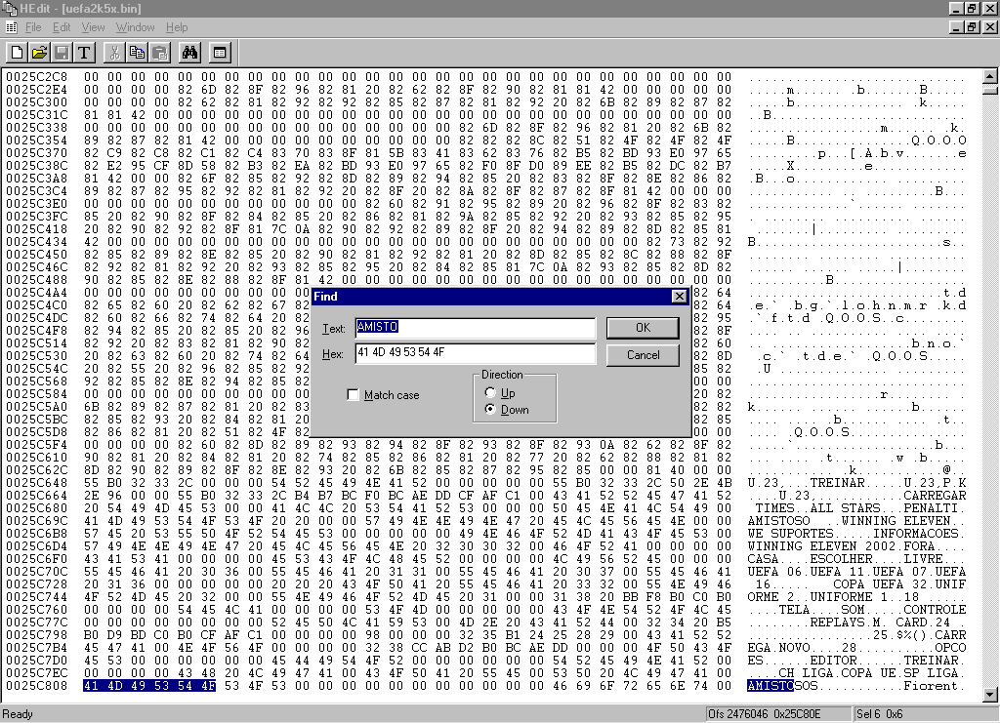
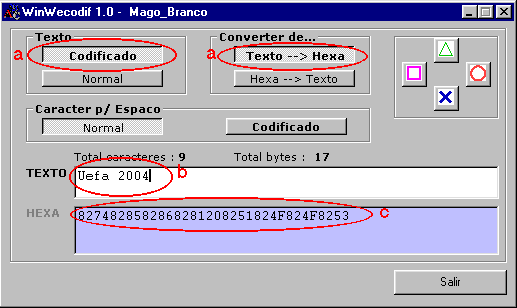
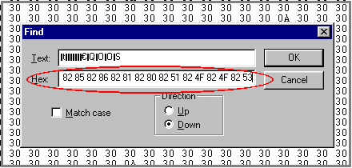
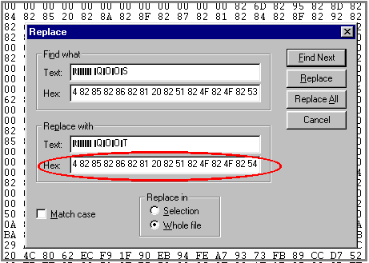

# 10 — Textos no jogo: alterando-os

> Voltar ao [índice geral](/docs/biblia-we2002/README.md).

**Programas usados nesse tutorial:** HEDIT, emulador ePSXe, WinWEcodific.

## Introdução

Os jogos da série Winning Eleven apresentam **3 tipos de textos**: textos
**abertos**, textos **criptografados** e textos **gráficos**.

Cada um desses textos utiliza um método completamente diferente do outro pra ser
alterado; logo, você terá que identificar que tipo de texto é aquele e utilizar o
método correto pra fazer a alteração.

Por exemplo: na tela principal, onde no jogo editado se lê AMISTOSOS, LIGA,
COPA, etc., é um **texto aberto**; já os nomes dos times são **textos
criptografados**; e todos os textos contidos nas primeiras telas que iniciam o
jogo são **gráficos** — ou seja, estão contidos dentro de imagens.

---

## 10a — Texto aberto: alterando-o

Para alterar um texto aberto é muito simples. Siga os seguintes passos:

**1º)** Execute o jogo no emulador (ePSXe) e **anote em um papel** o texto que
você deseja alterar. Cuidado: anote direitinho todas as letras e as diferenças
entre maiúsculas e minúsculas, caso haja. Terminado, feche o emulador.

**2º)** Execute um editor hexadecimal (o autor usa o HEDIT) e abra a imagem do
jogo.

**3º)** Mande fazer a localização de um trecho da palavra. No exemplo abaixo
localizaremos a palavra **AMISTOSOS**; para isso pressione `CTRL+F` no HEDIT,
digite o trecho `AMISTO` e dê OK.

**4º)** Obviamente você poderá encontrar mais de uma vez a palavra que procura.
Nesse contexto, observe que logo acima está a palavra LIGA, que corresponde à
palavra próxima a AMISTOSOS que está na abertura do UEFA.

**5º)** Clique sobre o início da palavra e faça a alteração normalmente,
digitando o novo texto que você quer pôr no lugar.

> **MAS ATENÇÃO:** O QUE VOCÊ DIGITAR TERÁ QUE SER **EXATAMENTE DO MESMO TAMANHO
> OU MENOR** DO QUE O TAMANHO DA PALAVRA ORIGINAL, visto que logo após virá o
> delimitador `00 00 00 00` e ele não poderá ser rompido. Se você fizer isso,
> perderá todo o jogo.

**6º)** Pronto! Feita a alteração, salve, saia e teste no emulador.

---

## 10b — Texto criptografado: alterando-o

Textos criptografados são textos que, para serem localizados, você irá precisar
primeiro passar o texto por um programa criptografador — visto que o texto não
está aberto, e o que aparecerá serão apenas números. Então você deverá passar seu
texto antes por esse programa para poder localizá-lo.

Alguns exemplos de textos criptografados são os **nomes dos times** e as **notas
de rodapé** que aparecem na tela de escolha de opções de jogo. Siga os passos:

**1º)** Assim como no anterior, execute o jogo no emulador (ePSXe) e anote em um
papel o texto que você deseja alterar. **MUITO CUIDADO:** anote direitinho todas
as letras e as diferenças entre maiúsculas e minúsculas, caso haja, e muito, mas
muito cuidado com os **espaços** entre duas palavras. Terminado, feche o
emulador.

**2º)** Execute o **WinWEcodif** e, na parte de texto, deixe marcado
**Codificado** e **Texto → Hexa** (a). Então, em **TEXTO**, digite o texto que
você deseja localizar no jogo.

**3º)** Agora, na caixa **HEXA**, copie (`CTRL+C`) todo o conteúdo numérico que
aparece.

**4º)** Abra o jogo com o editor hexadecimal e mande localizar — nesse caso
utilizando o HEDIT (`CTRL+F`).

**5º)** Note que no **LOCALIZAR (FIND)** há uma caixa pra você digitar o **TEXT**
ou o **HEX**; então, na caixa **HEX**, cole (`CTRL+V`) o conteúdo copiado
anteriormente do WEcodif.

**6º)** Se você anotou o nome corretamente conforme o original, copiou e mandou
localizar tudo corretamente, então o programa deverá localizar a sequência que
você procura — o que significa dizer que você acabou de achar o texto a ser
mudado. Deixe o localizado marcado.

**7º)** Agora volte ao WEcodif e digite o novo texto que você deseja inserir no
lugar do anteriormente localizado.

> **CUIDADO:** observe o total de caracteres e o total de bytes a serem
> inseridos; sempre insira a mesma quantia que irá sobrescrever, ainda que
> complete com espaços em branco.

**8º)** Pronto, copie agora, na caixa **HEXA** (c), o conteúdo que apareceu.

**9º)** Retorne ao editor hexa, onde você deixou o texto a ser substituído
marcado. **LEMBRE-SE:** substitua no máximo **50 caracteres por vez**.

**10º)** No editor hexa execute o comando **REPLACE** (`CTRL+H`). Ele irá abrir
uma caixa onde, na parte superior, existe o texto marcado; logo, na caixa **HEX**
de baixo, cole o seu novo texto.

**11º)** Aperte o botão **REPLACE** e veja se a mensagem foi positiva. Se sim,
execute o comando salvar no editor hexa e teste o jogo no emulador.

---

## 10c — Texto em imagem: alterando-o

Os textos em imagem são como o próprio nome diz: **imagens**. Ou seja, você pode
lê-los, mas dentro do jogo eles não estão em um formato texto que pode ser
alterado como qualquer texto padrão — esses textos estão dentro de uma imagem.

Para descobrir se um texto é gráfico, primeiro mande buscá-lo pelo método de
[texto aberto](#10a--texto-aberto-alterando-o); se não encontrá-lo, então
procure-o como um [texto criptografado](#10b--texto-criptografado-alterando-o);
se ainda assim não encontrá-lo, então ele só pode ser um texto-imagem.

Para localizar um texto-imagem você deverá seguir exatamente os mesmos métodos de
mudança de qualquer [imagem no jogo](/docs/biblia-we2002/11-imagens.md).

A título de informação, alguns textos-imagem são:

| Texto | Arquivo |
| --- | --- |
| Textos nas imagens do início do jogo | `LOGO.BIN` |
| Textos da tela de escolha de opções de jogo (aquela em que aparecem as camisas 2D) | `DATSEL.BIN` |
| Textos dos nomes dos times que aparecem antes da partida iniciar | `T_NAME.BIN` |

---

Próxima seção: [11 — Imagens no jogo](/docs/biblia-we2002/11-imagens.md)
