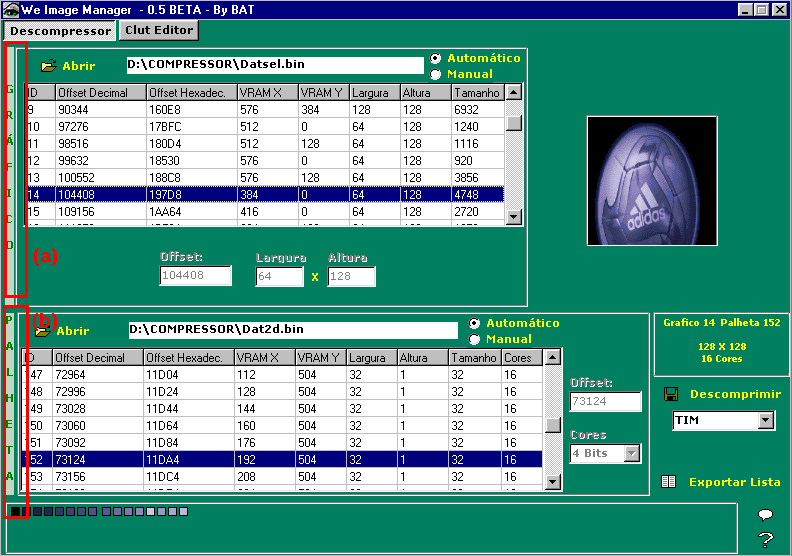
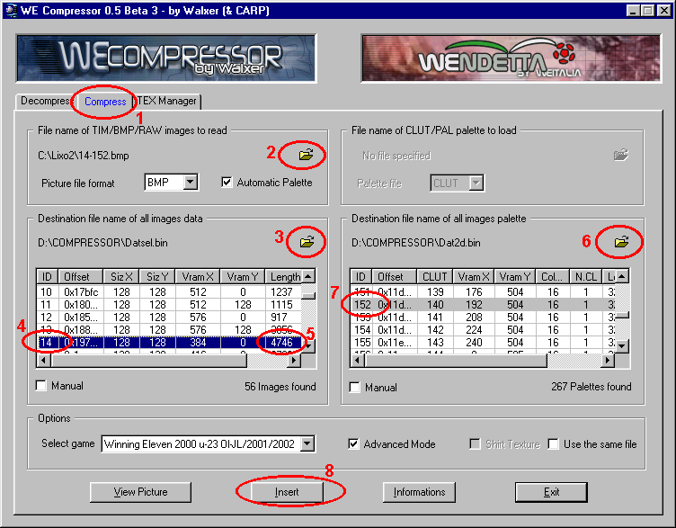

# 11 — Imagens no jogo: alterando-as

> Voltar ao [índice geral](/docs/biblia-we2002/README.md).

**Programas usados nesse tutorial:** HEDIT, CDMAGE, WEZIP, WE COMPRESSOR, WE
IMAGE MANAGER, CLUTED.

## Introdução

Até bem pouco tempo atrás, o máximo que podíamos mudar de uma imagem gráfica do
jogo eram suas **cores** — por isso só podíamos fazer os uniformes de um time
pegando um uniforme original do jogo e mudando suas cores. Porém, eis que devido
aos gênios **Walxer, Lagarto, Warlock e Jordinator**, hoje contamos com não
apenas um, mas **dois conversores gráficos**: o **WEZIP** e o **WE COMPRESSOR**.
Com eles, e com a ajuda do **WE IMAGE MANAGER** do nosso super brasileiro
**BAT**, podemos extrair qualquer gráfico, modificá-lo e reinseri-lo no jogo.
Palmas pra esses caras!

## Executando

São **3 os passos** pra mudar uma imagem:

1. Localizar a imagem e sua paleta de cores correta.
2. Extrair a imagem e editá-la em um editor gráfico a seu gosto.
3. Recomprimir a imagem para o formato do PlayStation e reinseri-la no jogo.

---

## 11a — Imagens: localizando

Para localizar uma imagem você utilizará o programa **WE IMAGE MANAGER**, e terá
que encontrar primeiramente o **gráfico** e logo depois a **paleta de cores**,
para só então fazer a extração da TIM e poder fazer a edição.

Logo, o primeiro passo é saber **em que arquivo está o gráfico** que você quer
editar. Para isso leia esse tutorial e veja se aqui está indicado o que você
deseja mudar; se não tiver, pergunte ao pessoal da edição na internet. Após isso,
sabendo em que arquivo está o gráfico, o próximo é saber em que arquivo está a
paleta, pois muitas vezes o gráfico está em um arquivo e a paleta em outro — às
vezes, entretanto, está no mesmo.

Se você tiver que localizar o gráfico manualmente, sem que alguém tenha lhe
ensinado antes o gráfico e a paleta, usando o WE IMAGE MANAGER é simples: é só
abrir a imagem na parte superior **(a)** com uma paleta qualquer, desde que seja
multicolorida, e vá passando um a um os gráficos até achar o gráfico. No caso da
paleta, para alguns gráficos dá pra seguir o mesmo procedimento — ou seja, deixe
a imagem localizada aberta na parte de cima e vá passando uma por uma a paleta na
parte de baixo **(b)**. Quando você localizá-la, se tiver tudo certo, faça alguma
alteração e teste no emulador.

---

## 11b — Imagens: inserindo-as

Alterar um gráfico é o processo de:

- **localizá-lo** (ao localizá-lo, anote sempre o **ID** ou **OFFSET**, tanto do
  gráfico como da paleta, e o **tamanho** que aparece no WE IMAGE MANAGER);
- **extraí-lo** ainda em formato `.TIM` — visto que o WE IMAGE MANAGER tem a
  opção de extrair já em BMP, porém esse sai com as cores em 24 bits e assim
  você perde a paleta original, que pode ser de 16 ou 256 cores;
- e, tendo o arquivo TIM, **transformá-lo para `.BMP`** com o programa TIMUTIL.
  Aí você o edita em um programa gráfico de sua preferência e, por fim, o compacta
  e insere de volta dentro do arquivo original.

Esse processo de compactar e inserir a imagem após editá-la é o que ensinaremos
agora. Existem **2 métodos**: o primeiro e mais simples é com o **WE COMPRESSOR**
do Walxer; o outro método é com o **WEZIP** do pessoal do Hispano.

---

### 11b1 — Inserindo com o WE COMPRESSOR do Walxer

Após ter a imagem pronta (ou seja, editada), siga os passos abaixo para
inseri-la. Mas cuidado: lembre-se de que **o jogo aceita apenas imagens de 16 ou
256 cores**; perceba se a imagem se encaixa na original que você vai inserir.

**a)** Execute o programa **WE COMPRESSOR**.

**b)** Clique agora na aba **Compress** (1).

**c)** Clique em seguida na pastinha amarela da caixa **“File name of TIM/BMP
images to read”** (2) e mande abrir o arquivo de imagem `.BMP` que você editou.
(Não custa lembrar que o jogo aceita apenas imagens com 16 ou 256 cores, e você
terá que ter olhado qual o formato dessa imagem que irá inserir.)

**d)** Agora clique na pastinha amarela da caixa **“Destination file name of all
image data”** (3), que traduzindo quer dizer *“arquivo de destino para a
imagem”* — ou seja, é aqui que você abre o arquivo do jogo WE no qual irá inserir
a imagem editada (por exemplo `datsel.bin`, `gdc_od.bin`, `logo.bin`, etc.).

**e)** Lembra que lá em cima pedimos pra anotar o **ID** ou o **OFFSET**
referente ao gráfico que irá mudar? Agora procure-o na caixa com as opções dos
offsets e IDs (4) e clique nele, pois é o lugar onde será inserido o gráfico. Mas
cuidado: **o tamanho aqui informado (5) poderá não ser correto**, principalmente
se você está usando um arquivo já editado — é por isso que foi pedido a você para
anotar o tamanho no WE IMAGE MANAGER, pois lá o tamanho é correto.

**f)** Agora clique na pastinha amarela da caixa **“Destination file name of all
image Palette”** (6), que traduzindo quer dizer *“arquivo de destino a inserir a
paleta”* — ou seja, a depender do gráfico que você está editando, a paleta de
cores poderá ser nele mesmo ou poderá ser em outro; daí que nesse local se abre o
arquivo para inserir a paleta.

**g)** Volto a dizer que foi pedido pra você anotar o ID ou OFFSET do gráfico ou
da paleta (7); agora vá na caixa de escolha do ID ou offset — aqui você irá
precisar indicar o ID ou OFFSET **da paleta** que será inserida.

**h)** Por último, clique no botão **“Insert”** (8) e aguarde para ver a mensagem
que irá dar. Se for a de que o arquivo é grande e não se aconselha a inserção,
lembre-se do tamanho do arquivo que você anotou olhando no WE Image Manager e
confira: se realmente for maior que esse tamanho, então você terá que voltar a
editar a imagem e extrair detalhes ou reduzir o tamanho dos gráficos; se o
tamanho mostrado na caixa for **menor** do que o que aparece no WE Image Manager,
então, mesmo que o programa desaconselhe, mande inserir que tudo ficará bem.

---

### 11b2 — Inserindo com o compressor do Hispano (WEZIP)

Siga os mesmos passos do que foi ensinado acima, inserindo imagens com o WE
Compressor; só que, no referente à preparação da imagem, agora, tendo a imagem,
siga os seguintes passos:

**a)** Execute o **TIMUTIL** e mande converter a imagem BMP para TIM.

**b)** Execute o **WEZIP**, clique no botão **COMPRIMIR**, escolha a imagem `.TIM`
criada anteriormente e mande compactá-la. Ele gerará um arquivo de mesmo nome, só
que com o final `.BIN`, que é o arquivo pronto a ser inserido no jogo.

**c)** Voltamos ao que foi pedido acima, para você anotar o ID ou OFFSET do
gráfico e da paleta — só que aqui precisaremos do **OFFSET**.

**d)** Abra agora o arquivo em que irá inserir a imagem em um editor hexadecimal
(tomando por base o HEDIT) e mande ele localizar o OFFSET da imagem.

**e)** Em uma outra tela, abra o arquivo `.BIN` gerado por você e copie todo o
conteúdo.

> **LEMBRE-SE DE TER O CUIDADO DE OBSERVAR O TAMANHO QUE O ARQUIVO FICOU** — se é
> igual ou menor ao do original. Se não, refaça.

**f)** Vá até o arquivo onde será inserido, que já está no offset correto, e mande
colar. Pronto, o gráfico está inserido; feche tudo e vamos inserir a paleta.

**g)** Execute o programa **CLUTED**, vá em **“EXTRACT CLUT FROM FILE”** e
localize o arquivo em formato `.TIM` da imagem que você deseja inserir. Ele lhe
pedirá o offset: informe **20**. Ele lhe pedirá o tamanho: aí você terá que ter
observado no WE IMAGE MANAGER se o arquivo é de **16 ou 256 cores** e informar
aqui.

**h)** Pronto: com a paleta aberta, agora clique em **INJECT CLUT IN FILE**,
escolha o arquivo que deverá receber a paleta e clique em OK. Em seguida ele lhe
pedirá o offset a inserir — informe o que você anotou antes. Então ele lhe
perguntará o tamanho — informe o tamanho que você também anotou. Clique em OK e
pronto: gráfico e paleta inseridos.

---

Próxima seção: [12 — Estádios: alterando-os](/docs/biblia-we2002/12-estadios.md)
