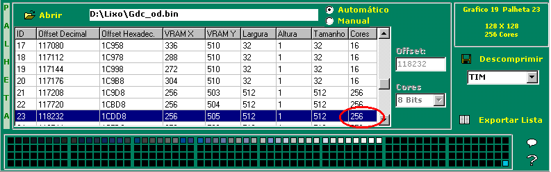
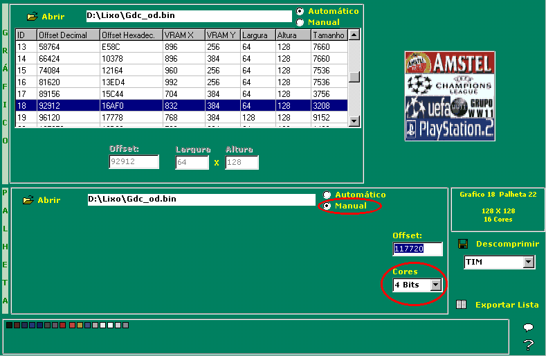
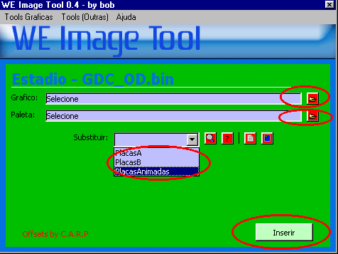
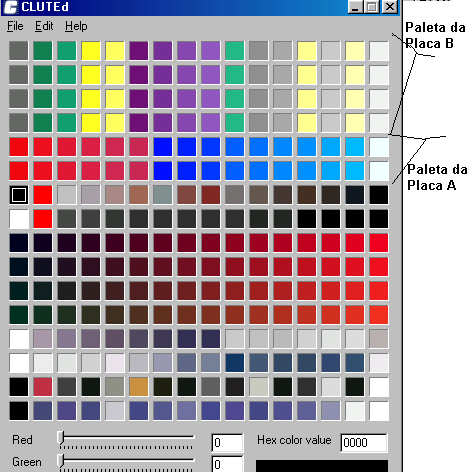

# 12 — Estádios: alterando-os

> Voltar ao [índice geral](/docs/biblia-we2002/README.md).

**Programas usados nesse tutorial:** CDMAGE, WE COMPRESSOR (Walxer), WE IMAGE
MANAGER, WE IMAGE TOOL, WEZIP.

## Introdução

Editar estádios é nada mais que mudar características nos estádios existentes e
deixá-los parecidos com outros estádios. Por exemplo: se você pegar o estádio de
Wembley (original do jogo) e mudar o placar eletrônico, as placas, algumas faixas
e pequenos gráficos nas arquibancadas, ele irá se parecer com o Maracanã.

Já ouvi comentários de pessoas que conseguiram mexer na estrutura dos estádios,
dando-lhes outras formas, mas pra isso usaram programas 3D como o AutoCAD.
Obviamente não sei se isso é verdade, pois não vi os resultados, mas a
possibilidade existe. Por enquanto, o único método possível é o abaixo.

## Ordem dos estádios no jogo

Esses arquivos encontram-se na pasta **BIN** do jogo.

| Estádio | De dia | De noite |
| --- | --- | --- |
| Estádio 01 | `GDC_OD` | `GDC_ON` |
| Estádio 02 | `GDC_VD` | `GDC_VN` |
| Estádio 03 | `GDC_DD` | `GDC_DN` |
| Estádio 04 | `GDC_FD` | `GDC_FN` |
| Estádio 05 | `GDC_JD` | `GDC_JN` |
| Estádio 06 | `GDC_SD` | `GDC_SN` |
| Estádio 07 | `GDC_MD` | `GDC_MN` |
| Estádio 08 | `GDC_AD` | `GDC_AN` |
| Estádio 09 | `GDC_PD` | `GDC_PN` |
| Estádio 10 | `GDC_CD` | `GDC_CN` |
| Estádio 11 | `GDC_HD` | `GDC_HN` |
| Estádio 12 | `GDC_TD` | `GDC_TN` |
| Estádio 13 | `GDC_GDJ` | `GDC_GNJ` |
| Estádio 14 | `GDC_MDJ` | `GDC_MNJ` |
| Estádio 15 | `GDC_RDJ` | `GDC_RNJ` |
| Estádio 16 | `GDC_BD` | `GDC_BN` |
| Estádio 17 | `GDC_ID` | `GDC_IN` |

---

## 12a — Estádios: alterando gráficos

Alterar estádios, como dito, é apenas mudar os gráficos. Logo, use o tutorial de
edição de [imagens no jogo](/docs/biblia-we2002/11-imagens.md) e siga os
seguintes passos:

**a)** Execute o jogo no emulador e escolha um estádio.

**b)** Verifique qual outro estádio se assemelha com aquele.

**c)** Agora analise os gráficos que existem e podem ser modificados: entradas,
marquises, estruturas metálicas, etc.

**d)** Agora olhe na tabela acima qual o arquivo do seu estádio e copie-o para uma
pasta à parte. (Lembre-se sempre de ter cópias de segurança.)

**e)** Agora abra esse arquivo no **WE IMAGE MANAGER** do Bat, escolha uma paleta
qualquer e saia passando gráfico por gráfico à procura do que você anotou antes
no emulador e deseja mudar agora.

**f)** Pronto: encontrado o gráfico, siga os passos do tutorial de edição de
imagens no jogo, faça as modificações desejadas e salve; rode no emulador e
voilà! Você terá o estádio que quiser.

---

## 12b — Estádios: placas de publicidade

Existem **2 métodos** de editar as placas de publicidade. O primeiro e mais
simples é usando o programa **WE IMAGE TOOL** do Bob, que insere as placas para
você; porém, o programa tem falhas, e alguns estádios ficam com as placas
inseridas erradas — daí você terá que utilizar o segundo método e colocá-las
manualmente.

### Introdução

- Cada estádio contém **3 tipos de placas**, e nós damos a elas os nomes de
  **placas A, B e C**.
- O tamanho padrão das 3 placas é de **128 × 128 pixels**.
- As placas **A e B** devem ser feitas com **16 cores**.
- A placa **C** deve ser feita **até com 256 cores** — mas você pode usar menos se
  quiser. Por sinal, deve-se usar menos cores caso se deseje gráficos mais
  elaborados; caso contrário ele não conseguirá ser inserido no arquivo.
- A placa **A** deve conter apenas a 1ª e a 2ª propagandas, pois a 3ª e a 4ª não
  aparecem.

---

### 12b1 — Localizando as placas de publicidade e suas paletas no jogo

Para qualquer método de edição você precisará primeiramente aprender a localizar
e extrair as placas, para utilizar as existentes como modelo base. E no método
manual você utilizará esse método de localização para saber os offsets de onde
deverá inserir. Siga os passos:

**a)** Escolha um estádio qualquer no jogo — o autor usa o primeiro estádio,
`GDC_OD.BIN`. Agora copie-o para uma pasta a seu gosto.

**b)** Execute o programa **WE IMAGE MANAGER** do BAT e mande abrir o arquivo do
estádio escolhido, tanto na parte referente ao gráfico como na referente à
paleta.

**c)** Agora **a grande dica**: para localizar as placas, comece pela **paleta da
placa C**. Para localizá-la é fácil: basta, ao abrir o WE IMAGE MANAGER, ir na
parte de baixo referente às paletas e observar que, na coluna **CORES**, todas as
primeiras têm 256 cores; observe que, se você rolar para baixo, começarão a
aparecer algumas paletas com 16 cores e logo após voltará outra sequência com 256
cores. **A 3ª (terceira) paleta dessas é a paleta da placa C.**

**d)** Encontrada a paleta da placa C, vá para a parte de cima do Image Manager e
vá passando um a um os gráficos até encontrar as **placas C** — elas virão logo
após as A e B. Encontrado, veja se está casando tudo corretamente (paleta e
gráfico). Se estiver tudo OK, vamos agora encontrar as placas A e B.

**e)** Para encontrar a **placa B** é fácil: basta ir em gráfico e colocar **um
gráfico acima** do da placa C já encontrada. Já referente à paleta, é só fazer o
mesmo — ou seja, é só ir **uma paleta acima** da paleta da placa C. Porém, você
terá que clicar no item **MANUAL** e, na caixa **CORES**, clicar em **4 bits** —
e voilà, a placa irá aparecer corretamente no gráfico acima.

**f)** Já as **placas A** seguem um princípio parecido: na parte referente a
gráfico, coloque **um gráfico acima** e você terá encontrado as placas A. Já a
paleta, você precisará usar a cabeça ou a calculadora, pois a paleta continuará a
ser **a mesma que a da placa B** — só que você terá que **somar ao valor 128**.
Pronto: substitua o valor na caixa offset e você terá a paleta da placa A.

> **Em resumo:** as três placas ficam A, B e C uma logo após a outra; as paletas
> das placas A e B ficam juntas, e a da placa C é a terceira da segunda sequência
> de gráficos com 256 cores. É preciso, entretanto, dizer que, apesar de estarem
> juntas como se fossem uma só paleta de 256, as paletas das placas A e B estão
> **camufladas** aqui — pois elas são de 16 bits na realidade.

---

### 12b2 — Editando as placas de publicidade (criando as placas)

Lembre-se: placas de publicidade são imagens comerciais. Logo, procure-as na
internet ou escaneie rótulos de produtos para conseguir as imagens; em seguida
monte-as conforme abaixo.

#### a) Edição da placa A

- Crie em um editor gráfico (o autor usa o COREL PHOTO PAINT) uma imagem em
  branco de **128 × 128 pixels**, inicialmente com padrão de cores normais — ou
  seja, 24 ou 32 bits.
- Insira a primeira e a segunda placa; cada uma deve ter **32 × 128 pixels**.
  Cuidado com as cores: muitas cores serão distorcidas depois, e muitos detalhes
  não irão aparecer.
- Feita a imagem, agora mande converter para **16 cores**. No COREL PHOTO PAINT
  isso é feito clicando em **IMAGEM → MODO → CORES DA PALETA (8 BITS)** e, por
  último, configurando **Paleta: Otimizada, 16 cores**. Salve — e está pronta a
  placa A.
- Lembre-se de que você poderá também pegar uma placa pronta, utilizando o método
  de [localizar as placas](#12b1--localizando-as-placas-de-publicidade-e-suas-paletas-no-jogo),
  e usá-la como modelo, ou editar sobre ela.

#### b) Edição da placa B

É igual à edição da placa A, só que, ao invés de você colocar somente as 2
primeiras placas de cima, aqui você irá colocar **todas as 4 placas** —
lembrando que cada uma tem 32 × 128 pixels.

#### c) Edição da placa C

- A placa C também deve ser iniciada com uma imagem de **128 × 128 pixels** com
  cores totais, ou seja, 24 ou 32 bits.
- Escolha as 4 imagens e insira assim como fez na placa B.
- Agora siga os mesmos passos ensinados na placa B; porém, na hora de informar a
  quantidade de cores, informe **256** ao invés de 16 cores.
  **Uma dica:** se sua placa não couber, insira menos cores — coloque menos de 256
  e a imagem ficará menor.

> Volto a repetir: em todos os 3 casos acima você poderá utilizar o método de
> localizar as placas de publicidade, extrair uma placa já pronta (seja A, B ou
> C) e usá-la como base.

---

### 12b3 — Inserindo com o WE IMAGE TOOL do Bob

É o método mais fácil; porém, o programa ainda tem falhas — mas são poucas, logo
vale a pena combinar os dois métodos. Para inserir com o programa do Bob, faça
assim:

**a)** Tendo criado as placas em formato BMP, agora vamos passá-las para o formato
`.TIM`; para isso siga os passos que foram ensinados referentes ao **TIMUTIL**.
Ao finalizarmos, teremos os arquivos `PLACA_A.tim`, `PLACA_B.tim` e
`PLACA_C.tim`. **Não as apague** após a compressão a seguir, pois elas contêm as
paletas de cores.

**b)** Execute agora o programa **WEZIP** e clique no botão **COMPRIMIR**: se
forem as placas A e B, escolha a opção **4 bits**; se for a placa C, escolha a
opção **8 bits**. Vá então onde você salvou os arquivos convertidos e mande
compactá-los um por um. Ao final teremos os arquivos `PLACA_A.bin`,
`PLACA_B.bin` e `PLACA_C.bin`.

**c)** Abra agora o programa **WE IMAGE TOOL** do Bob, vá em **TOOLS GRÁFICAS** e
clique em **GERAL**.

**d)** Ele irá pedir **SELECIONE O ARQUIVO A EDITAR**; aqui escolha o estádio no
qual você irá inserir as placas de publicidade.

**e)** Na próxima tela, siga os seguintes passos:

- Clique primeiro em **SUBSTITUIR** e escolha qual placa irá substituir: **A**,
  **B** ou **C** (aqui chamada de *animadas*).
- Agora em **GRÁFICO** clique no disquetinho e escolha o arquivo `.BIN`
  (comprimido) referente à placa escolhida.
- Em **PALETA** escolha o arquivo `.TIM` de mesmo nome do seu arquivo gráfico.
- Pronto, agora é só clicar em **inserir**.

**f)** Com os gráficos inseridos na placa, você poderá testá-la usando o WE IMAGE
MANAGER do Bat, ou poderá inserir o arquivo do estádio no jogo usando o CDMAGE e
testá-lo no emulador — a escolha é sua.

---

### 12b4 — Inserindo manualmente com o compressor

Aqui você terá que inserir estádio a estádio, e somente as **placas C** poderão
já ser inseridas com a paleta; as **A e B** terão que ter paletas colocadas
depois. Para isso siga os passos:

**a)** Inicialmente vá em
[localizando as placas de publicidade](#12b1--localizando-as-placas-de-publicidade-e-suas-paletas-no-jogo)
e anote seus offsets, tanto dos gráficos como das paletas.

**b)** Agora execute os tutoriais sobre como
[inserir uma imagem no jogo](/docs/biblia-we2002/11-imagens.md) e, utilizando seu
método favorito, insira os gráficos e as paletas das **placas C**.

**c)** Tendo inserido os gráficos e as paletas C, vamos inserir as paletas das
placas A e B; pra isso você usará o **CLUTED**. Basta ir até o arquivo `.TIM` da
placa B inserida e, na posição **20** (offset 20), onde se iniciam as paletas,
inserir o número **16 cores**; e, ao abrir as cores, copiá-las.

**d)** Nesse momento, no próprio CLUTED, mande ele abrir de novo **EXTRACT CLUT
FROM FILE** e informe como número do offset aquela paleta de 256 cores que contém
as paletas A e B escondidas — que na verdade é a paleta logo acima da paleta da
placa C. (Se estiver achando esse papo complicado, dê uma olhada no tutorial de
localizar as placas, que suas dúvidas serão sanadas.)

**e)** Pronto, será aberto como o gráfico abaixo — ou seja, a placa B tem o mesmo
gráfico repetido nas 4 primeiras posições. Logo, já que você copiou antes, marque
e cole no lugar correto; repita isso nas quatro linhas. Não esqueça de, logo em
seguida, clicar em **INJECT CLUT IN FILE** e informar esse mesmo arquivo e essa
mesma paleta que está aberta, pra as alterações serem salvas.

**f)** Repita o processo com as **placas A**, ou seja: abrindo o arquivo `.TIM` no
CLUTED, copiando as 16 cores, abrindo o arquivo a inserir a paleta e indo até a
paleta e inserindo nas duas posições referentes às placas A.

---

### 12b5 — Ordem em que as placas se apresentam em campo

As **placas C**, que são as que ficam no fundo do gol, não precisam ser explicadas
aqui, pois apenas ficam subindo e descendo — não têm ordem. Mas as placas das
laterais precisam. Nelas podemos chamá-las, como convém, de **placas A** e
**placas B**: as placas A são as que se encontram somente 2 nos gráficos do jogo;
já as placas B são as que contêm todas as 4.

Logo, a ordem das placas no campo é:

| Posição | Sequência |
| --- | --- |
| Atrás dos gols | A1, A2, PLACAS C, A2, A1 |
| Na lateral | B4, A2, B2, B4, A1, B4, B3, A2, A1, B4, B1, A2, B2, B4, A1, B1 |

Logo, cada placa, durante cada jogo, se repete o seguinte número de vezes:

| Placa | Repetições |
| --- | --- |
| A1 | 5 |
| A2 | 5 |
| B1 | 2 |
| B2 | 2 |
| B3 | 1 |
| B4 | 5 |

---

Próxima seção: [X — Transferindo todos os uniformes de uma ISO para outra](/docs/biblia-we2002/x-transferir-uniformes.md)
