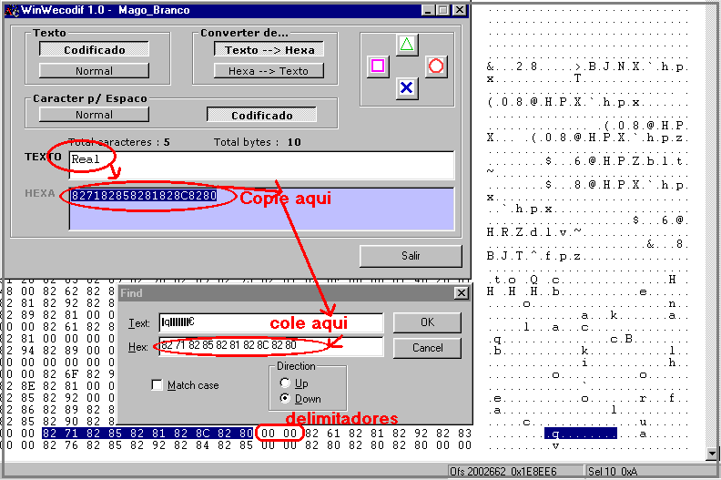

# X2 — Colocando os times do menu com nomes completos, sem serem cortados

> Dicas e manhas especiais. Voltar ao [índice geral](/docs/biblia-we2002/README.md).

**Programas usados nesse tutorial:** editor hexadecimal HEDIT, emulador ePSXe,
WinWEcodif.

## Introdução

Normalmente, quando alteramos os nomes dos times que aparecem no menu de escolha
através de qualquer editor — seja o WE Team Editor ou o Wemania —, times com
nomes grandes, como “Corinthians”, que tem onze letras, ficam **cortados**,
aparecendo apenas as primeiras letras (tipo “Corin”).

Para isso, a partir do Brasileirão 2003, foi desenvolvida a técnica que
possibilita a colocação de nomes completos — que tem como “entretanto” o fato de
que você deverá **retirar times do jogo**, cujos espaços dos nomes serão
utilizados pelos times que ficarão.

## Executando

**1)** Execute o emulador ePSXe, vá até a tela de escolha de times e anote em um
papel o nome do time que você deseja modificar.

> **MUITO CUIDADO:** o nome tem que ser anotado **exatamente** como está lá, com
> letras maiúsculas, minúsculas e espaços exatamente como aparece.

**2)** Agora execute o método de
[texto criptografado](/docs/biblia-we2002/10-textos.md#10b--texto-criptografado-alterando-o),
usando o **WinWEcodific** e o seu programa hexadecimal, para localizar esse texto
(nome do time).

**3)** Você localizará um conjunto numérico e irá notar que, após essa sequência
que corresponde ao nome do time, irá haver **dois pares de zero `00 00`** — esses
são os **delimitadores** entre o nome de um time e o nome do próximo time.

**4)** Vá agora até esse `00 00` e copie a sequência que irá aparecer logo após
ele, até os próximos `00 00`. Lembre-se: **não copie os próprios `00 00`**, só os
números entre eles. Para copiar esses valores, aperte `CTRL+F` e os valores irão
aparecer na caixa **HEX**; copie-os marcando-os e apertando `CTRL+C` — a simples
cópia direta às vezes não surte efeito sem apertar o `CTRL+F`.

**5)** Vá agora até o WinWEcodif e clique no botão **HEXA → TEXTO** na caixa
converter, e cole o valor copiado. Nesse momento você verá o nome do time que
deverá ser apagado utilizando a técnica de
[retirar times do menu](/docs/biblia-we2002/x1-ordem-times-menu.md). Você pode
retirá-lo agora ou deixar para depois — mas **não esqueça de fazê-lo**, caso
contrário ele irá aparecer com o nome todo errado durante o jogo.

**6)** Pronto, volte à sequência que você encontrou anteriormente e conte quantos
caracteres você tem, sendo que agora o nome do seu time poderá passar por cima de
uma sequência de delimitadores `00 00`. Lembre-se: cada par de numerais
corresponde a uma letra — tipo `82 71` é a letra **“R”**. Pronto, agora você pode
colocar o nome mais comprido, visto que você está utilizando o espaço do nome do
outro time **mais** o espaço do delimitador, que você deverá escrever por cima.

**7)** Para poder colocar o nome mais comprido, como dito, saiba o tamanho total
de espaços que você terá agora. Então vá até o WinWEcodif, clique em **TEXTO →
HEXA**, digite um nome que caiba nesse espaço, copie e cole-o conforme ensinado
na técnica de
[texto criptografado](/docs/biblia-we2002/10-textos.md#10b--texto-criptografado-alterando-o).

**8)** Salve e teste no emulador.

---

Próxima seção: [X3 — Destravando o menu Copas](/docs/biblia-we2002/x3-destravar-copas.md)
