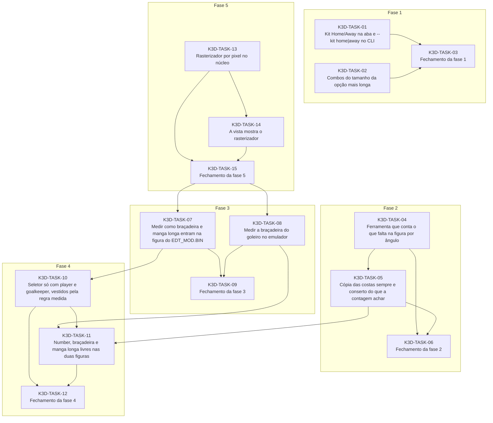

# Progress — kits-3d

## Scope

<!-- What this cycle delivers, in two or three sentences. -->

## Dependency graph

<!-- Generated from each task's depends_on; prose explaining the order goes below the region. -->
<!-- rite:begin graph -->

<!-- rite:end -->

## Tasks

<!-- rite:begin tasks -->
| ID | Title | Phase | Type | Depends on | Status | Done on | Reviewed on |
| --- | --- | --- | --- | --- | --- | --- | --- |
| [K3D-TASK-01](/docs/tasks/kits-3d/01-kit-home-away.md) | Kit Home/Away na aba e --kit home\|away no CLI | 1 | implementação | — | done | 2026-10-07 | 2026-10-07 |
| [K3D-TASK-02](/docs/tasks/kits-3d/02-combos-ajustados.md) | Combos do tamanho da opção mais longa | 1 | implementação | — | done | 2026-10-07 | 2026-10-07 |
| [K3D-TASK-03](/docs/tasks/kits-3d/03-fechamento-fase-1.md) | Fechamento da fase 1 | 1 | closing | K3D-TASK-01, K3D-TASK-02 | done | 2026-10-07 | 2026-10-07 |
| [K3D-TASK-04](/docs/tasks/kits-3d/04-buracos-por-angulo.md) | Ferramenta que conta o que falta na figura por ângulo | 2 | ferramenta | — | done | 2026-10-07 | 2026-10-07 |
| [K3D-TASK-05](/docs/tasks/kits-3d/05-costas-sempre.md) | Cópia das costas sempre e conserto do que a contagem achar | 2 | implementação | K3D-TASK-04 | done | 2026-10-07 | 2026-10-07 |
| [K3D-TASK-06](/docs/tasks/kits-3d/06-fechamento-fase-2.md) | Fechamento da fase 2 | 2 | closing | K3D-TASK-04, K3D-TASK-05 | done | 2026-10-07 | 2026-10-07 |
| [K3D-TASK-13](/docs/tasks/kits-3d/13-rasterizador-nucleo.md) | Rasterizador por pixel no núcleo | 5 | implementação | — | done | 2026-10-08 | 2026-10-08 |
| [K3D-TASK-14](/docs/tasks/kits-3d/14-vista-rasterizador.md) | A vista mostra o rasterizador | 5 | implementação | K3D-TASK-13 | done | 2026-10-08 | 2026-10-08 |
| [K3D-TASK-15](/docs/tasks/kits-3d/15-fechamento-fase-5.md) | Fechamento da fase 5 | 5 | closing | K3D-TASK-13, K3D-TASK-14 | done | 2026-10-08 | 2026-10-08 |
| [K3D-TASK-07](/docs/tasks/kits-3d/07-medir-geometria-edt-mod.md) | Medir como braçadeira e manga longa entram na figura do EDT_MOD.BIN | 3 | investigação | K3D-TASK-15 | done | 2026-10-08 | 2026-10-08 |
| [K3D-TASK-08](/docs/tasks/kits-3d/08-medir-bracadeira-goleiro.md) | Medir a braçadeira do goleiro no emulador | 3 | verificação | K3D-TASK-15 | done | 2026-10-08 | 2026-10-08 |
| [K3D-TASK-09](/docs/tasks/kits-3d/09-fechamento-fase-3.md) | Fechamento da fase 3 | 3 | closing | K3D-TASK-07, K3D-TASK-08 | done | 2026-10-08 | 2026-10-08 |
| [K3D-TASK-10](/docs/tasks/kits-3d/10-duas-figuras.md) | Seletor só com player e goalkeeper, vestidos pela regra medida | 4 | implementação | K3D-TASK-07 | done | 2026-10-08 | 2026-10-08 |
| [K3D-TASK-11](/docs/tasks/kits-3d/11-caixas-livres.md) | Number, braçadeira e manga longa livres nas duas figuras | 4 | implementação | K3D-TASK-05, K3D-TASK-08, K3D-TASK-10 | done | 2026-10-09 | 2026-10-09 |
| [K3D-TASK-12](/docs/tasks/kits-3d/12-fechamento-fase-4.md) | Fechamento da fase 4 | 4 | closing | K3D-TASK-10, K3D-TASK-11 | done | 2026-10-09 | pending |
<!-- rite:end -->

## Notes
