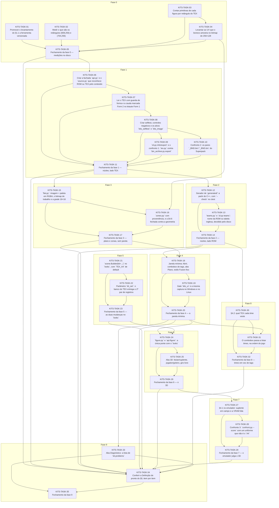

# Progress — kits

## Scope

Visualizador de uniformes (os 105 `TEX_<tag>.BIN` ou um TEX avulso) em 2D e 3D, Python + Qt, em `tools/kits/`, importando o núcleo do `tools/looks/`. Só lê. Fonte: [PLAN-KITS-PY.md](/docs/PLAN-KITS-PY.md).

## Dependency graph

<!-- rite:begin graph -->

<!-- rite:end -->

## Tasks

<!-- rite:begin tasks -->
| ID | Title | Phase | Type | Depends on | Status | Done on | Reviewed on |
| --- | --- | --- | --- | --- | --- | --- | --- |
| [KITS-TASK-01](/docs/tasks/kits/01-levantamento-do-tex.md) | Promover o levantamento do §1.1 a ferramenta versionada | 0 | ferramenta | — | done | 2026-09-30 | 2026-09-30 |
| [KITS-TASK-02](/docs/tasks/kits/02-retangulos-608-e-704.md) | Medir o que são os retângulos (608,256) e (704,256) | 0 | investigação | — | done | 2026-09-30 | 2026-09-30 |
| [KITS-TASK-03](/docs/tasks/kits/03-primitivas-por-retangulo.md) | Contar primitivas de cada figura por retângulo do TEX | 0 | investigação | — | done | 2026-09-30 | 2026-09-30 |
| [KITS-TASK-04](/docs/tasks/kits/04-uv-no-bitmap-de-trabalho.md) | Levantar as UV que o boneco amostra no bitmap de 256×128 | 0 | investigação | KITS-TASK-03 | done | 2026-09-30 | 2026-09-30 |
| [KITS-TASK-05](/docs/tasks/kits/05-fechamento-fase-0.md) | Fechamento da fase 0 — medições no disco | 0 | closing | KITS-TASK-01, KITS-TASK-02, KITS-TASK-03, KITS-TASK-04 | done | 2026-09-30 | 2026-09-30 |
| [KITS-TASK-06](/docs/tasks/kits/06-fachada-e-origem.md) | Criar a fachada `api.py` e o `source.py` que reconhece ROM ou TEX pelo conteúdo | 1 | implementação | KITS-TASK-05 | done | 2026-09-30 | 2026-10-01 |
| [KITS-TASK-07](/docs/tasks/kits/07-tex-e-guarda-de-forma.md) | Ler o TEX com guarda de forma e a cauda marcada Form 2 no leiaute Form 1 | 1 | implementação | KITS-TASK-06 | done | 2026-10-01 | 2026-10-01 |
| [KITS-TASK-08](/docs/tasks/kits/08-selftest-e-ctest.md) | Criar selftest, controles negativos e os alvos `kits_selftest` e `kits_image` | 1 | infra | KITS-TASK-07 | done | 2026-10-01 | 2026-10-01 |
| [KITS-TASK-09](/docs/tasks/kits/09-cli-e-confronto-1.md) | `cli.py info/export` e o confronto 1: `tex.py` contra `bin_archive.py export` | 1 | verificação | KITS-TASK-08 | done | 2026-10-01 | 2026-10-01 |
| [KITS-TASK-10](/docs/tasks/kits/10-confronto-2-superpack.md) | Confronto 2: os pares `_BND.bin`/`_BND.tim` do Superpack | 1 | verificação | KITS-TASK-08 | done | 2026-10-01 | 2026-10-01 |
| [KITS-TASK-11](/docs/tasks/kits/11-fechamento-fase-1.md) | Fechamento da fase 1 — núcleo, lado TEX | 1 | closing | KITS-TASK-06, KITS-TASK-07, KITS-TASK-08, KITS-TASK-09, KITS-TASK-10 | done | 2026-10-01 | 2026-10-01 |
| [KITS-TASK-12](/docs/tasks/kits/12-gerador-de-nomes.md) | Gerador de `generated/` a partir do C++, com `--check` no ctest | 2 | ferramenta | KITS-TASK-11 | done | 2026-10-01 | 2026-10-01 |
| [KITS-TASK-13](/docs/tasks/kits/13-nomes-dos-times.md) | `teams.py` e `cli.py teams`: nome da ROM ou tabela inglesa, decidido pelo disco | 2 | implementação | KITS-TASK-12 | done | 2026-10-01 | 2026-10-01 |
| [KITS-TASK-14](/docs/tasks/kits/14-fechamento-fase-2.md) | Fechamento da fase 2 — núcleo, lado ROM | 2 | closing | KITS-TASK-12, KITS-TASK-13 | done | 2026-10-01 | 2026-10-02 |
| [KITS-TASK-15](/docs/tasks/kits/15-flat.md) | `flat.py`: imagem + paleta em RGBA, o bitmap de trabalho e a grade 16×16 | 3 | implementação | KITS-TASK-11 | done | 2026-10-02 | 2026-10-02 |
| [KITS-TASK-16](/docs/tasks/kits/16-zonas.md) | `zones.py` com proveniência, e a §4.6 fechada contra a geometria | 3 | verificação | KITS-TASK-15, KITS-TASK-04 | done | 2026-10-02 | 2026-10-02 |
| [KITS-TASK-17](/docs/tasks/kits/17-fechamento-fase-3.md) | Fechamento da fase 3 — plano e zonas, sem janela | 3 | closing | KITS-TASK-15, KITS-TASK-16 | done | 2026-10-02 | 2026-10-02 |
| [KITS-TASK-18](/docs/tasks/kits/18-janela-minima.md) | Janela mínima: Abrir, combobox de tags, aba Plano, estilo Fusion fixo | 4 | implementação | KITS-TASK-14, KITS-TASK-17 | done | 2026-10-02 | 2026-10-02 |
| [KITS-TASK-19](/docs/tasks/kits/19-kits-ui-e-captura.md) | Gate `kits_ui` e a mesma captura no Windows e no Linux | 4 | verificação | KITS-TASK-18 | done | 2026-10-02 | 2026-10-02 |
| [KITS-TASK-20](/docs/tasks/kits/20-fechamento-fase-4.md) | Fechamento da fase 4 — a janela mínima | 4 | closing | KITS-TASK-18, KITS-TASK-19 | done | 2026-10-02 | 2026-10-02 |
| [KITS-TASK-21](/docs/tasks/kits/21-looks-builder-kit.md) | `scene.Builder(kit=...)` no `looks`, com `TEX_A4` de default | 5 | implementação | — | done | 2026-10-02 | 2026-10-02 |
| [KITS-TASK-22](/docs/tasks/kits/22-looks-kit-set.md) | Parâmetro `kit_set`: o banco do TEX entrega o 2º par de registros | 5 | implementação | KITS-TASK-21 | done | 2026-10-02 | 2026-10-03 |
| [KITS-TASK-23](/docs/tasks/kits/23-fechamento-fase-5.md) | Fechamento da fase 5 — as duas mudanças no `looks` | 5 | closing | KITS-TASK-21, KITS-TASK-22 | done | 2026-10-03 | 2026-10-03 |
| [KITS-TASK-24](/docs/tasks/kits/24-figura.md) | `figure.py` e `api.figure`: a única ponte com o `looks` | 6 | implementação | KITS-TASK-20, KITS-TASK-23 | pending | — | — |
| [KITS-TASK-25](/docs/tasks/kits/25-aba-3d.md) | Aba 3D: titular/suplente, jogador/goleiro, giro livre | 6 | implementação | KITS-TASK-24 | pending | — | — |
| [KITS-TASK-26](/docs/tasks/kits/26-fechamento-fase-6.md) | Fechamento da fase 6 — o 3D | 6 | closing | KITS-TASK-24, KITS-TASK-25 | pending | — | — |
| [KITS-TASK-27](/docs/tasks/kits/27-titular-e-suplente-no-jogo.md) | §4.1 no emulador: suplente em campo e a VRAM lida | 7 | investigação | KITS-TASK-26 | pending | — | — |
| [KITS-TASK-28](/docs/tasks/kits/28-confronto-3.md) | Confronto 3: `confront.py --score` com um uniforme que não é o `A4` | 7 | verificação | KITS-TASK-27 | pending | — | — |
| [KITS-TASK-29](/docs/tasks/kits/29-fechamento-fase-7.md) | Fechamento da fase 7 — o emulador julga o 3D | 7 | closing | KITS-TASK-27, KITS-TASK-28 | pending | — | — |
| [KITS-TASK-30](/docs/tasks/kits/30-tabela-time-tag.md) | §4.2: qual TEX cada time veste | 8 | investigação | KITS-TASK-14 | pending | — | — |
| [KITS-TASK-31](/docs/tasks/kits/31-combobox-de-times.md) | O combobox passa a listar times, na ordem do jogo | 8 | implementação | KITS-TASK-30, KITS-TASK-20 | pending | — | — |
| [KITS-TASK-32](/docs/tasks/kits/32-fechamento-fase-8.md) | Fechamento da fase 8 — times em vez de tags | 8 | closing | KITS-TASK-30, KITS-TASK-31 | pending | — | — |
| [KITS-TASK-33](/docs/tasks/kits/33-aba-diagnostico.md) | Aba Diagnóstico: a lista de `kit.problems` | 9 | implementação | KITS-TASK-20 | pending | — | — |
| [KITS-TASK-34](/docs/tasks/kits/34-definicao-de-pronto.md) | Conferir a Definição de pronto do §0, item por item | 9 | verificação | KITS-TASK-05, KITS-TASK-11, KITS-TASK-14, KITS-TASK-17, KITS-TASK-20, KITS-TASK-23, KITS-TASK-26, KITS-TASK-29, KITS-TASK-32, KITS-TASK-33 | pending | — | — |
| [KITS-TASK-35](/docs/tasks/kits/35-fechamento-fase-9.md) | Fechamento da fase 9 | 9 | closing | KITS-TASK-33, KITS-TASK-34 | pending | — | — |
<!-- rite:end -->

## Notes
